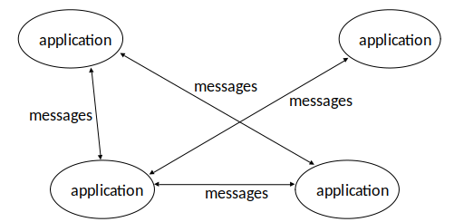

# Introduction

Kirk has returned. No recordings.
Please check the wiki.

Expected to be Java wizards in terms of coding. Data Management (COMP1204) knowledge inferred.

[Syllabus](https://secure.ecs.soton.ac.uk/module/1819/COMP2207/38696/syllabus)

A lot of acronymns to learn. We focus on a few of these.

Looking at the layers of the OSI model and Java socket programming, network tools.
Worksheets are available.

## Module Breakdown

65% - Examination
Traditional type of exam

35% - Coursework
15% on networking
20% on distributed systems
Both very hands on, "make some stuff"

## Materials

Lecture slides available online

## Distributed Systems

Components located at networked computers communicating/coordinating actions *solely* via message passing

### Characteristics

* Concurrency
* Coordination
* Components may fail independently
* Intended for resource sharing
  * Hardware
  * Software
  * Computation power
  * Storage

### Applications

* Finance
  * Finance markets
  * Online banking
* eCommerce
  * Amazon
  * eBay
* Information society
  * Search engine
  * Libraries
  * Social networking
* Healthcare
  * Patient records
* Education
  * VLEs
  * Collaborative learning
* Science
  * Networked high-performance computing
* Transports/Logistics
  * Location-based
  * Map services
* Environment
  * Kirk's business

