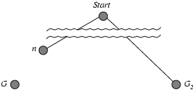

# Heuristic Searches

We use an evaluation function for each node, which is an estimate of 'desirability.'

We then order the nodes in the fringe in decreasing order of the function.

#### Greedy Best-First Search

Evaluation function $f(n) = h(n) =$ estimate of cost from n to goal
e.g. $h_{SLD}(n) =$ straight-line distance

GBFS expands node that appears closest

* Not complete, can be stuck in loops
* Time: $O(b^m)$, good heuristic means improvement
* Space: $O(b^m)$, all nodes in memory
* Not optimal

#### A* Search

Avoid expanding paths that are already expensive

$f(n) = g(n) + h(n)$
$g(n) =$ cost so far
$h(n) =$ estimated cost from n to goal

#### Admissible Heuristic

A heuristic is admissible if for every node $h(n) \leq h^*(n)$ where $h^*(n)$ is true cost to reach the goal state from n. It never overestimates the cost to reach the goal.

If $h(n)$ is admissible, A* using tree search is optimal.

Suppose some suboptimal goal state $G_2$ has been generated and is in fringe.
Let $n$ be unexpanded node in the fringe such that $n$ is on shortest path to an optimal goal $G$ with true cost $C^*$.