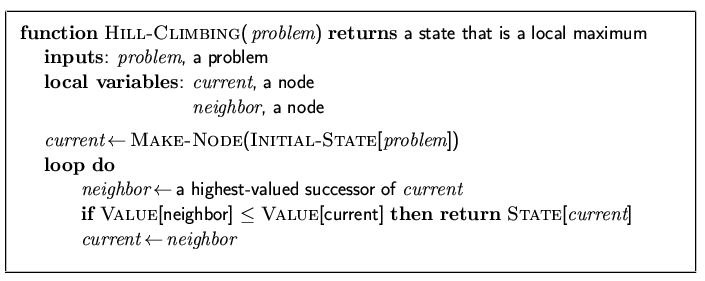
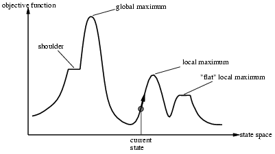
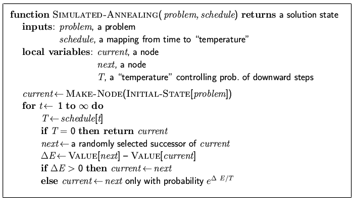

# Local Search

Optimisation problems, where only goal state matters and path is irrelevant.

The state space is the set of 'complete' configs. We find a config that satisfies constraints.

We use local search algorithms and keep a single current state and try to improve it.

#### Hill Climbing

"Like climbing Everest in thick fog with amnesia."

Depending on the initial state, one can get stuck in a local maxima.

#### Simulated Annealing Search

Escape a local maxima by allowing some bad moves but gradually decrease their likelihood.

If $T$ decreases slowly enough, then simulated annealing search will find a global optimum. In *asymptotic limit*, time required is exponential in the problem size. 

#### Local Beam Search

Keeps track of $k$ states rather than just one, start with $k$ randomly generated states.
Each iteration, all successors of all $k$ states arre generated.
If any goal, stop. Else select $k$ best successors and repeat.

Exploits parallelism, but can become narrowly focussed in small region of search area.

#### Genetic Algorithms

Successor state made by combining two parent states.
Start with $k$ randomly generated states (*population*)

A state is a string over finite alphabet.
Eval function (*fitness func*) scores states.

Produce the next generation through selection, crossover and mutation.