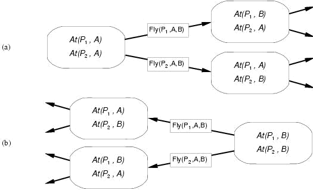

# Planning

Generate and search over possible plans.
Consists of states, actions and goals.

Fully observable, deterministic, finite, static and discrete.

## Planning Language

Expressive enough to describe wide variety of problems

Restrictive enoguh to allow efficient algorithms to operate on it

Planning algorithm should take advantage of logical structure of problem

### General Features

Decompose world into logical conditions and represent a state as conjunction of postive literals.

* Poor ^ Unknown
* At(Plane1, Melbourne) ^ At(Plane2, Sydney)

A goal is satisfied if the state contains all literals in goal.

Action = Precond + Effect
*Action*: Fly(p, from, to)
*Precond*: At(p, from) ^ Plane(p) ^ Airport(from) ^ Airport(to)
*Effect*: ¬At(p, from) ^ At(p, to)

An action is applicable in any state that satisfies its preconditions.
For first-order action schema, applicability involves substituion $\theta$ for the variables in the precondition.

## Planning with State-Space Search

Both forward and backward search possible.

Progressions planners consider the effect of all possible actions in a given state.

Regression planners consider what must have been true in the previous state.

### Progression

Formulate as state-space search problem

*Initial state*: Initial state of planning problem
*Possible actions*: Those with satisfies preconds
*Goal test*: Does the state satisfy the goal?
*Step cost*: Each action costs 1.

