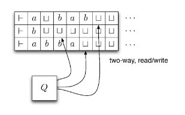

# Decidability and Universal Turing Machines

We can define a TM with multiple tapes.

Input is on the first tape, others tapes are blank initially.
Transition function of type $\delta : Q\times \Gamma^3 \rightarrow Q\times \Gamma^3 \times \{L,R\}^3$

Not any more powerful than an ordinary one-tape TM, as we can use similar construction as in lecture 14 to construct a one-tape TM $N$ that simulates multi-tape TM $M$.

## Universal Turing Machine

There exists a TM $U$ such:

$L(U)=\{M\#x  | x \in L(M)\}$
$M\#x$ means an encoding of $M$ followed by the seperator $\#$ followed by the encoding of the string $x$ in $M$'s input alphabet.

$U$ operates as follows:

1. Check whether $M$ and $x$ are correct encodings, reject if not
2. Simulate $M$ on $x$ 
3. Accept if $M$ accepts, reject otherwise

## Construct a UTM $U$ 

Simulated on $M\#x$. Check that the encodings of the machine and string are correct.
We will use three tapes to store:

1. The description of $M$
2. The contents of $M$'s tape
3. $M$'s current state and position on the tape

Each step of $U$ is as follows:

1. Look at $M$'s current state and head position
2. Read the tape contents at the correct position
3. Read the relevant transition
4. Simulate the transition, and update the tape, state and head positions
5. Accept if $M$ accepts, reject if $M$ rejects.