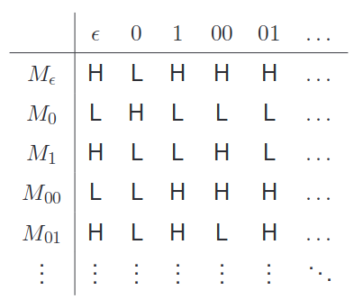

# Halting Problem and Diagonalisation

Universal TM on $M\#x$ will loop if $M$ loops on $x$.
Can we pose a smarter TM, such as $HP \overset{def}{=}\{M\#x| M \text{ halts on } x\}$
Can we come up with a total TM $K$, such that on $M\#x$ it:

* Halts and accepts if $M$ halts on $x$ 
* Halts and rejects if $M$ loops on $x$

## Diagonalisation

We can use a similar argument that can be used to show that there does not exist a total TM $K$ that decides whether, given some TM $M$ and input $x$, $M$ halts on $x$.

### Proof

Suppose we are given a total TM $K$ that does what we want. It decides whether a TM halts or not on a given input.

Consider the TM $N$ that on $x$:

1. Constructs $M_x$ from $x$ and writes $M_x\#x$ on the tape
2. Runs $K$ on $M_x\#x$
3. If $K$ accepts then $N$ goes into a trivial loop. If it rejects, $N$ accepts.

$N$ is not in the table -the behaviour differs from $M_b$ at $b$.

We have produced a contradiction, a TM that is not in the table. Hence $K$ cannot exist, and therefore the set $HP$ is not recursive.  However, the set $HP$ is recursively enumerable.
This means that $¬HP$ is not recursively enumerable.