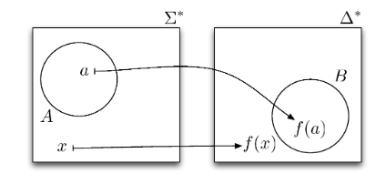

# Reductions

$HP$ and $MP$ describe arbitrary inputs to TMs.

Can we decide, given any TM $M$ as input, whether $M$ accepts $\epsilon$?
Is $A \overset{def}{=}\{M|\epsilon\in L(M)\}$ recursive?
No! We can reduce $HP$ to $A$.

Suppose that $K$ is a total TM that accepts $A$.
Constuct $N$ that, on input $M\#x$:

1. Construct $M'$, that on any input $y$ ignores its inptu and simulates $M$ on $x$.
   If $M$ accepts or rejects, $M'$ accepts.
2. Simulate $K$ on $M'$, if $K$ accepts then accept, if reject then reject.

$N$ accepts $M\#x \iff K$ accepts $M' \iff \epsilon \in L(M') \iff M$ halts on $x$.
We have shown, through reduction from $HP$ that $MP$ and $A$ are undecidable.

If $A$ or $MP$ was decidable, there would be a total TM for it
We could use that TM to solve $HP$.

## Formal Definition

A function $f:\Sigma^* \rightarrow \Delta^*$ is computable when there exists a total TM $K$ that when started with $x\in \Sigma^*$ on its tape, eventually halts with $f(x)\in \Delta^*$ on its tape.

A reduction of $A \subseteq \Sigma^*$ to $B\subseteq \Delta^*$ is a computable function $f:\Sigma^* \rightarrow \Delta^*$ such that $x \in A \iff f(x)\in B$.

We write $A\leq B$ If there is a reduction from $A$ to $B$.

## Examples

$HP \leq MP$
$M\#x \mapsto M'\#x$

$HP \leq \{M \text{ }|\text{ } \epsilon \in L(M)\}$
$M\#x \mapsto M'$

## Properties

If $A \leq B​$ and $B​$ is recursively enumerable, then $A​$ is recursively enumerable.
If $A$ is not recursively enumerable, $B$ is not recusively enumerable.

### Proof

If $A \leq B$, there is a computable function $f$ that takes $a \in A$ and $f(a) \in B$. If $B$ is recursively enumerable, there exists a TM $M$ that accepts it.
We have a TM $N$ for $A$. On $x$, first compute $f(x)$, run $M$ on $f(x)$, accept if it accepts, reject if it rejects.

$x \in L(N) \iff f(x) \in L(M) \iff f(x) \in B \iff x \in A$