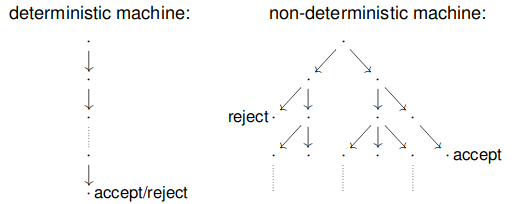

# Polynomial Time Problems

A computational problem is said to be feasible if it has an algorithm with time complexity $\leq$ some polynomial $f(n)$.
A problem that can be solved in finite time, but with no polynomial time algorithm is said to be infeasible.

A decision problem is a computational problem with the output being either yes or no.

## $P$ Class

The class $P$ is the set of all feasible decision problems. It doesn't matter what kind of machine it is, as long as the machine is Turing-complete. $P$ is the same to that machine as it is to any other Turing-complete machines.

Formally, the class $P$ is the set of all decision problems that can be solved in polynomial time by a *deterministic* Turing machine.

Every regular language is in $P$.

## $NP$ class

In order to attack how to define the class $NP$, we must first define a non-deterministic Turing machine.

### Non-deterministic Turing Machine (NDTM)

$M = (Q,\Sigma, \Gamma, \vdash, \sqcup, \delta, s, t, r)$
Similar definition as to that of a deterministic Turing machine, however we must change the transition function in order to give it the non-determinism.

$\delta:(Q-\{t,r\})\times \Gamma \rightarrow \mathcal{P}(Q\times \Gamma \times \{L,R\})$

An NDTM makes all possible transitions from a given configuration in parallel. The computation of a NDTM is a tree, whose branches are traversed in parallel.

It accepts if some branch leads to an accept state, and rejects if all branches lead to a reject state.

#### Non-deterministic and Deterministic Turing Machines

For any NDTM $N$, there is a deterministic TM $D$ accepting the same language.
A deterministic multi-tape TM can simulate a NDTM.

* One tape stores the input
* One tape is used to simulate a branch up to a given depth
* One tape is used to rememebr the branch being simulated

If it finds an accept state, it accepts. If not, it loops.
A language is RE if and only if some NDTM accepts it.

If we have a fourth tape that remembers the branches that halt and does not explore them again, we have a Turing machine that halts if $N$ halts on all branches.
A language is recursive if and only if some NDTM decides it.

### Comparing Computational Models

Let $t(n)$ be a function, where $t(n) \geq n$.

1. Every $t(n)$ time NTDM has an equivalent $O(t^2(n))$ time single-tape Turing machine
2. Every $t(n)$ time NTDM has an equivalent $2^{O(t(n))}$ time Turing machine

We can finally tackle the term $NP$.

The class $NP$ is the set of all decision problems that can be solved by a non-deterministic Turing machine in polynomial time.

Anything in $P$ is in $NP$. 

An alternative definition of $NP$ is that it is the set of all decision problems for which a solution can be checked by a Turing machine in polynomial time.

## $NP$ Examples

### SAT - Boolean satisfiability

Given a boolean expression, does there exist an assignment of 0s and 1s to the variable such that the formula is satisfied?

We can non-deterministically check all possible assignments to the variables, then substitute each in to check if it is satisfied.
Done in non-deterministic polynomial time.

### HAMPATH - Hamiltonian Path

Given a directed graph, does there exist a directed path connecting two given nodes that goes through each node exactly one?

We can non-deterministically generate all sequence of nodes of length equal to the size of the graph $n$, then check any sequence according to the rules of HAMPATH.

