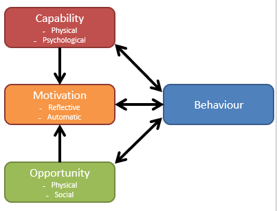
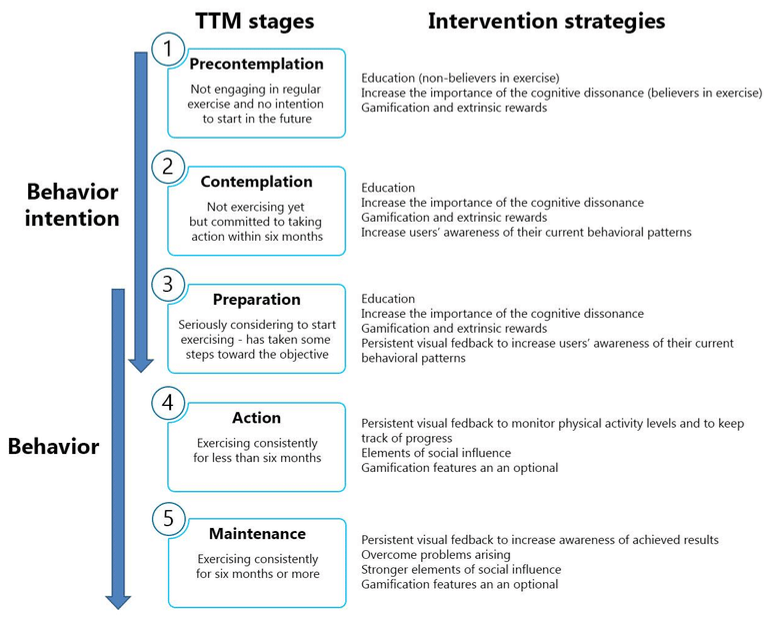

# Persuasive Design

Intervention design stages:

## Identify behaviours and target group

Be specific; do you want to encourage a behaviour or stop one?
Be targeted; the things that may influence one group may not influence another

## Identify what needs to change for your behaviour to occur or stop

Interviews or focus group (qualitative):

* Ask open questions about behaviour

Self-report questionnaires (quantitative)

* COM-B Self Evaluation Questionnaire

Review the literature on influences on behaviour

## Identify intervention content

Goal: Specify an intended behaviour or outcome

Implementation: A when, where and how plan that commits people to a certain time and place

### Understand and accommodate perspective of your target users

Focus on understand and accommodate perspective of the people who will use the intervention, in order to improve uptake, adherence and outcomes.

Carry out iterative qualitative research with a wide range of people from the target user population
Identify guiding principles that inform intervention

### Evaluate

Does it work?

Does it work as intended?

Is it acceptable and feasible to our target group?

Do people use it as intended?

