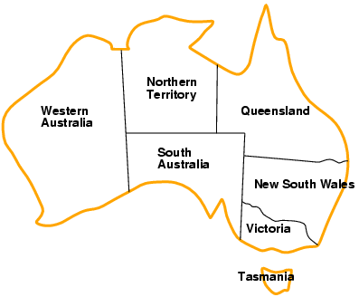
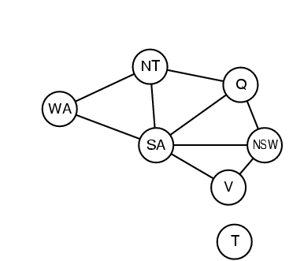
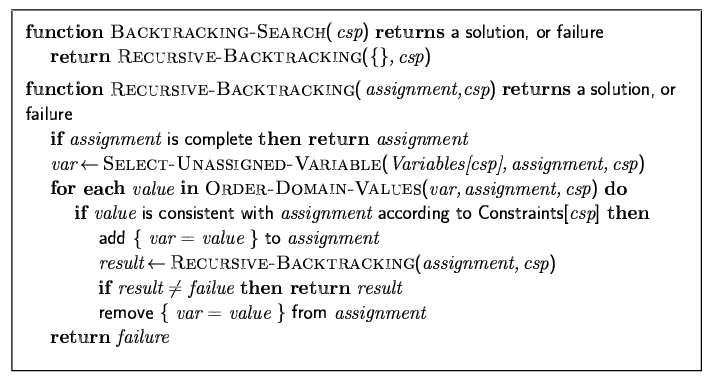

# Constraint Satisfaction Problem

State is a black box - a data structure that supports successor function, heuristic function and goal test.

A state is defined by variables $X_i$, with values from domain $D_i$.
A goal test is a set of constraints specifying allowable combinations of values for subsets of variables.
e.g. graph colouring, n-queens.

It is a simple example of a formal representation language.

It allows for useful general-purprose algorithms with more power than standard search algorithms.

## Map Colouring

We want to find a combination that allows for adjacent regions to have different colours.

*Variables*: WA, NT, Q, NSW, V, SA, T
*Domain*: $D_i = \{$Red, Green, Blue$\}$
*Constraint*: Adjacent regions must have different colours

We are using a *Binary CSP*, where each constraint relates two variables.
We can define a *constraint graph* where nodes are variables and arcs are constraints.

## Varieties of CSPs

Two main types based around discrete and continuous variables.

### Discrete Variables

* Finite domains
  * Boolean CSPs, SAT (NP-complete)
* Infinite domains
  * Job scheduling

### Continuous Variables

Start/end times of telescope observations
Linear constraints solvable in polynomial time by linear programming

## Standard Search Formulation

*Initial state*: Empty assignment { }
*Succ Func*: Assign value to unassigned variable that does not conflict current assignment
*Goal test*: Current assignment complete

Depth-first search for CSPs with single-variable assignments is called backtracking search.

## General Purpose Methods

General-purpose methods give gains in speed

* Which var should be assigned next?
* What orrder should values be tried?
* Can we detect failure early? 

### Most Constrained Variable

Choose variable which fewest legal values
Minimum remaining values (MRV)

### Most Constraining Variable

Variables with the most constraints on remaining variables
Useful tie-breaker amongst most constrained variables

### Least Constraining Value

Given var, choose least constraining value
The one that rules out the fewest values in the neighbouring variables

### Forward Checking

Keep track of remaining legal values for unassigned vars
Terminate when any var has no legal values left

### Constraint Propagation

Forward checking propagates info from assigned to unassigned vars; doesn't provide early detection for all failures
Constraint propagation repeatedly enforces constraints locally

### Arc Consistency

Make each arc consistent
X to Y is consistent if and only if for ever value x of X there is some allowed y.
If X loses a value, neighbours of X must be checked.
Finds errors earlier than forward checking.

## CSP Local Search

To apply local search to CSPs:

* Allow states with constraint violation
* Operators reassign var values

*Var selection*: Randomly select any conflicted var
Value section done by minimum conflicts heuristic

* Choose value that violates fewest constraints
* Hill-climb with $h(n) =$ total number of violated constraints

