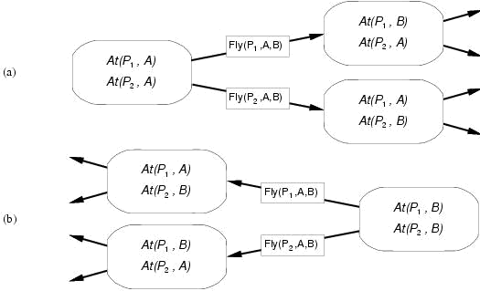
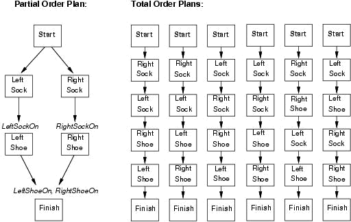

# Planning

Generate and search over possible plans.
Consists of states, actions and goals.

Fully observable, deterministic, finite, static and discrete.

## Planning Language

Expressive enough to describe wide variety of problems

Restrictive enoguh to allow efficient algorithms to operate on it

Planning algorithm should take advantage of logical structure of problem

### General Features

Decompose world into logical conditions and represent a state as conjunction of postive literals.

* Poor ^ Unknown
* At(Plane1, Melbourne) ^ At(Plane2, Sydney)

A goal is satisfied if the state contains all literals in goal.

Action = Precond + Effect
*Action*: Fly(p, from, to)
*Precond*: At(p, from) ^ Plane(p) ^ Airport(from) ^ Airport(to)
*Effect*: ¬At(p, from) ^ At(p, to)

An action is applicable in any state that satisfies its preconditions.
For first-order action schema, applicability involves substituion $\theta$ for the variables in the precondition.

## Planning with State-Space Search

Both forward and backward search possible.

Progressions planners consider the effect of all possible actions in a given state.

Regression planners consider what must have been true in the previous state.

### Progression

Formulate as state-space search problem

*Initial state*: Initial state of planning problem
*Possible actions*: Those with satisfies preconds
*Goal test*: Does the state satisfy the goal?
*Step cost*: Each action costs 1.

### Regression

Determine predecessors

Which states are immediately prior to the goal?
Actions must not undo desired literals
Only relevant actors considered.

* Give a goal description $G$
* Let $A$ be an action that is relevant and consistent
* Predecessors as follows:
  * Any positive effects of $A$ that appeared in $G$ deleted
  * Each precond literal of $A$ is added, unless it already appears
* Any standard search algorithm can be added to perform the search
* Termination when predecessor satisfied by initial state

### Heuristic

Neither progression nor regressions very efficient without good heuristic.
Exact solution is NP-hard.

Two approaches:

* Optimal solution to relaxed problem
* Sub-goal independence assumption

# Partial-Order Planning

Progression and regression cannot take advantage of problem decomposition.
Decisions must be made on how to sequence actions on all the subproblems.

Each state in search tree is a mostly unfinished plan.

Each plan has four components:

* Set of actions
* Set of ordering constraints
  * Cycles represent contradictions
* Casual links
  * A achieves p for B
* Open preconditions
  * If precondition is not achieved by action in the plan

A plan is consistent if and only iff there are no cycles in the ordering constraints and no conflicts with the casual links.
A consistent plan with no open preconditions is a solution.
A partial order plan is executed by repeatedly choosing any of the possible next actions.

Initial plan contains Start and Finish, ordering constraint Start < Finish, no casual links, all preconds in Finish are open.

Successor function:

* Picks one open precondition p on an action B
* Generates a successor plan for every possible consistent way of choosing action A that achieves p
* Test goal

Planning can be treated as proving a theorem in situation calculus.

