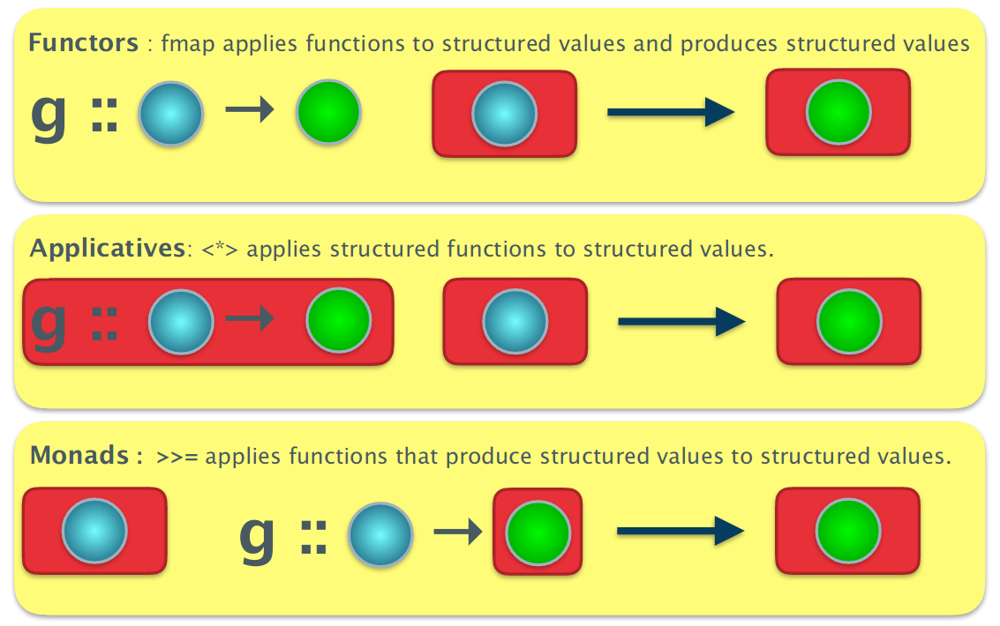

# Monads

We need something that can take a structured value and a function that may produce a structured result and apply the latter to the former to produce a structured result.

We can create the function >>=, which is known as bind.

``` haskell
>>= :: f a -> (a -> f b) -> f b	
```

For the Maybe type, bind is defined as follows:

``` haskell
>>= :: Maybe a -> (a -> Maybe b) -> Maybe b
mx >>= f = case mx of
             Nothing -> Nothing
             Just x -> f x
```

How do we know if there is a bind operator defined for a type?
There is a class - the Monad class.

``` haskell
class Applicative m => Monad m where
    return :: a -> m a
    (>>=)  :: m a -> (a -> m b) -> m b
    return = pure
```



Monads provide a uniform mechanism for dealing with extra bits of wiring needed to sequence together computations that have extra complications (errors, IO, non-determinism).

## List Monad

``` haskell
instance Monad [] where
    >>= :: [a] -> (a -> [b]) -> [b]
    xs >>= f = [ y | x <- xs, y <- f x ]
```

