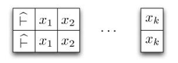

# Decidability

Define $L(M)$ for set of strings accepted by $M$.
A set of strings is called *recursively enumerable* when there is some TM $M$ that accepts it.

A TM that halts on all inputs is called *total*.
A language is called *recursive* when there is some *total* TM $M$ that accepts it.

Suppose $P$ is a property of strings.
$P$ is decidable $\overset{\text{def}}{=}\{x\in \Sigma^* | P(x)\}$ is recursive.
$P$ is semidecidable $\overset{\text{def}}{=}\{x\in \Sigma^* | P(x)\}$ is recursively enumerable.

Recursive sets are accepted by total TMs.
They are also closed under complement, you can prove it by having a TM that accepts the set. You then can create a TM that accepts the complement by swapping accept and reject states.

Recursively enumerable sets are accepted by ordinary TMs. They are not closed under complement.
If $A$ and $¬A$ are recursively enumerable, then $A$ is recursive. If w have a TM $M$ for $A$ and TM $M'$ for $¬A$, we can construct a total TM $N$ that simulates $M$ and $M'$ simultaneously.

Tape has two sets of symbols, one for $M$ and one for $M'$. Hats mark position of heads for each Turing machine.

For input $x_1 ... x_k$, $N$ rewrites non-empty portion of tape as follows:

$N$ performs as follows:

1. Scan tape to find hat in the upper section. Perform transitions according to $M$.
2. If $M$ accepts then $N$ accepts.
3. Scan tape to find hat in the lower section. Perform transitions according to $M'$.
4. If $M'$ accepts then $N$ rejects. Loop if not.

Any $x$ is either in $A$ or $¬A$, therefore either accepted or rejected by $N$. $N$ is total and $A$ is recursive.