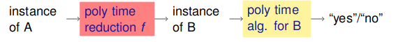
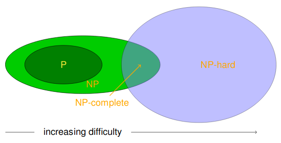

# NP-Completeness

A function $f:\Sigma^* \rightarrow \Delta^*$ is polynomial time computable if there exists a polynomial time Turing machine that halts on each input $w \in \Sigma^*$ with only $f(w)$ on its tape.

A polynomial time reduction from A to B, where A and B are decision problems, is a function $f$ which maps instance of A to instances of B, such:

* $f$ is computable in polynomial time
* For any instance $x$ of A, $x$ is a 'yes' instance of A iff $f(x)$ is a 'yes' instance.

We write $A \leq_P B$ if a polynomial time reduction exists from A to B.

Given an instance $x$ of A, compute $f(x)$ and run the algorithm for B on it. This tells us if $x$ is a 'yes' instance for A, and the time taken to do all of this is polynomial.

If $A \leq_P B$ and $B \in P$, then $A\in P$.
If $A \leq_P B$ and $A \notin P$, then $B \notin P$.

We can show that NP problems have a polynomial time reduction to other NP problems. This gives the property that if we find a polynomial time algorithm for one of those NP problems, we have therefore found a polynomial time algorithm for all the NP problems with polynomial time reductions to that particular problem.

## NP-Hard

The idea of a hard problem is that if we can reduce all NP problems to a specific problem in polynomial time, then that problem must be 'hard' as a polynomial time algorithm for that leads to a polynomial time algorithm for all NP problems.

### Cook-Levin Theorem

The Cook-Levin Theorem states that all problems in NP can be reduced down to the boolean satisfiability problem. Therefore, SAT is as hard as any NP problem.

If $\text{SAT} \in P$, then $P = NP$.

Given a decision problem, $X$, if every other decision problem $Y$ in $NP$ is polynomial time reducible to $X$ then $X$ is known as NP-hard.
If $X \in NP$, then $X$ is NP-complete.

If there exists an NP-hard or NP-complete problem in $P$, then $P=NP$.

