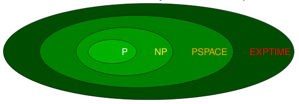

# Space Complexity

The space complexity of a decider is the function $f: \mathbb{N} \rightarrow \mathbb{N}$ where $f(n)$ is the maximum number of tape cells the machine scans on any branch of its computation, on any input of length $n$.

Assuming $f(n) \geq n$, if a decider runs in $f(n)$ space then it will run in $2^{O(f(n))}$ time.
There are $|Q| \times f(n) \times 2^{O(f(n))}$ possible configurations:

* $|Q|$ states
* $f(n)$ possible positions for the tape head
* $2^{O(f(n))}$ possibilities for the tape contents

A decider does not repeat configurations, so we get $f(n) \times 2^{O(f(n))}$ which is $2^{O(f(n))}$.

## $PSPACE$ and $NPSPACE$

The class $PSPACE$ is the set of all decision problems that can be solved by a Turing machine using polynomial space.
The class $NPSPACE$ is the set of all decision problems that can be solved by a NDTM using polynomial space.

Anything in $PSPACE$ is in $NPSPACE$. If it can be solved in polynomial space by a deterministic machine, it can also be solved by a non-determinstic one.

## Savitch's Theorem

We recall that a $t(n)$ time NDTM has an equivalent $2^{O(t(n))}$ time deterministic Turing machine. Things change for space complexity.

Assuming $f(n) \geq n$, every $f(n)$ space NDTM has an equivalent $f(n)^2$ space deterministic turing machine. As $PSPACE$ is all polynomial, this implies that $NPSPACE$ machines can be mapped to a $PSPACE$ machine with a squared space complexity.

Therefore, $PSPACE = NPSPACE$.

## $EXPTIME$

The class $EXPTIME$ is the set of all decision problems that can be solved by a Turing machine in time $O({2^n}^k)$ for some $k \in \mathbb{N}$.

## PSPACE-Completeness

A decision problem $X$ is PSPACE-complete if it is in $PSPACE$ and every problem $A$ in $PSPACE$ is polynomial-time reducible to $X$.