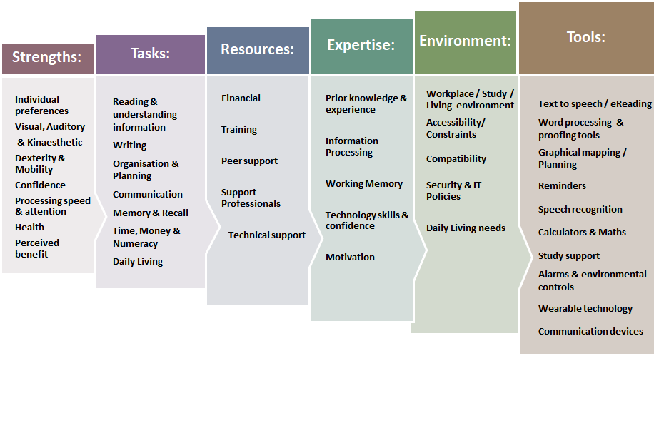

# Accessibility

## Assitive Tech

* Enlarging software
* Speech recognition
* Synthetic speech readback
* Refreshable braille display
* Scanner/OCR system

## Terminology

* Impairment
  * Physical/sensory/cognitive
* Disability
  * Effect of impariment
* Disabled
  * Disabled person

There is no such thing as an average user. Don't think about disability, think STREET.

