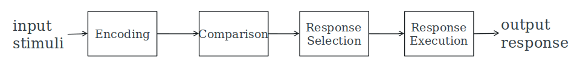

# Cognition

* Attention
* Perception
* Memory
* Learning
* Reading
* Problem-solving

## Attention

Selecting things to concentrate on at a point in time from mass of stimuli
Allows us to focus on relevant information

Focussed and undivided attention enables us to be selective in terms of the mass of competing stimuli

Make information salient when it needs attending to
Use techniques that make things stand out

* Colour
* Ordering
* Spacing
* Underlining
* Sequencing
* Animation

## Perception

How information is acquired from the world and transformed into experiences

* Icons
  * Enable users to readily distinguish their meaning
* Bordering and spacing
  * Effective visual ways of grouping information
* Sounds
  * Should be audible and distinguishable
* Speech output
  * Enable users to distinguish between set of spoken words
* Text
  * Legible and distinguishable from background
* Tactile feedback
  * Allow users to recognize and distinguish different meanings

## Memory

Information is encoded, which determines which information is attended to in the environment and how it is interpreted.
Linked up with other knowledge which makes it more likely to be remembered.

Context affects the extent to which information can be subsequently retrieved.

The magic number, 7 plus minus 2. Present only seven options on a menu, display only seven icons on a toolbar, seven bullet points in a list, etc...

Don't overload users memory with complicated procedures for carrying out tasks. Design interfaces that promote recognition rather than recall.

## Learning

Design interfaces that encourage exploration, that contrain and guide learners. Dynamically link concepts and representations faciliate learning of complex material.

## Reading

Speech-based menus and instructions should be short. Accentute intonation of artificially generated speech voices. Allow for text to be bigger.

## Problem-solving

Provide additional information/functions for users who wish to understand more about how to carry out an activity more effectively. Use simple computational aids to support rapid decision-making and planning for users on the move

## Cognitive Frameworks

Users develop an understanding of a system through learning about and using it. Knowledge is sometimes described as a mental model.

People make inferences using mental models of how to carry out tasks.

### Theory of Cognition

The Information Processor Model conceptualizes human performance in metaphorical terms of information processing stages.

The model:

* Models the information processes of a user interacting with a computer 
* Predicts which cognitive processes are involved when a user interacts with a computer
* Enables calculations to be made of how long a user will take to carry out a task

### External Cognition

Concerned with explaining how we interact with external representations (e.g. maps, notes, diagrams). What are the cognitive benefits and what processes involved. How they extend our cognition. What computer-based representations can we develop to help even more?

For example:

* Diaries, reminders, calendars, notes, shopping lists
* Post-its, piles, marked emails
* External representations

Provide external representations at the interface that reduce memory load and facilitate computational offloading

* Cognition involves several processes including attention, memory, perception and learning
* The way an interface is designed can greatly affect how well users can perceive, attend, learn and remember how to do their tasks
* Theoretical frameworks, such as mental models and external cognition, provide ways of understanding how and why people interact with products
* This can lead to thinking about how to design better products!