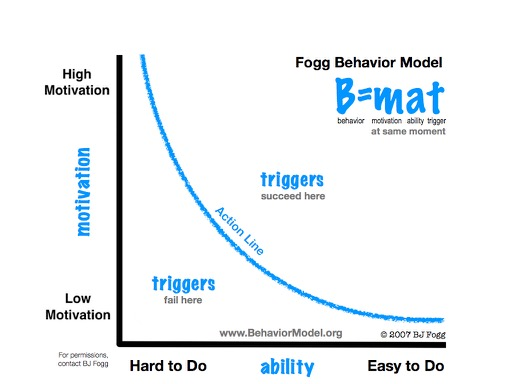

# HCI Theory II

## Normal Model of Interactions

Interaction is a cycle based upon two components: execution and evaluation

### Execution

* Establishing goal
* Forming intentions
* Specifying action sequence
* Executing action

### Evaluation

* Perceiving system state
* Interpreting system state
* Evaluating system state

## Affordances

The term used to refer to an attribute of an object that allows people to know how to use it and understand its properties.
The implicit suggestions of use that objects posses.

## Ortony's Model of Emotional Design

* Visceral
  * Parts of brain pre-wired to respond to events happening in physical world
  * Make products which look/sound/feel good
* Behavioural
  * Parts of brain that control behaviour
  * Design for usability, known conventions and behaviours
* Reflective
  * Parts of brain that enable contemplation
  * Aesthetic, encourage contemplation

## Distributed Cogntion

Redefining the fundamental unit of analysis for understand cognition
The people, environment and artefacts are considered one cognitive system

## Fogg's Behavioural Model

Three elements must converge at the same moment for a behaviour to occur:

* Motivation
* Ability
* Trigger

