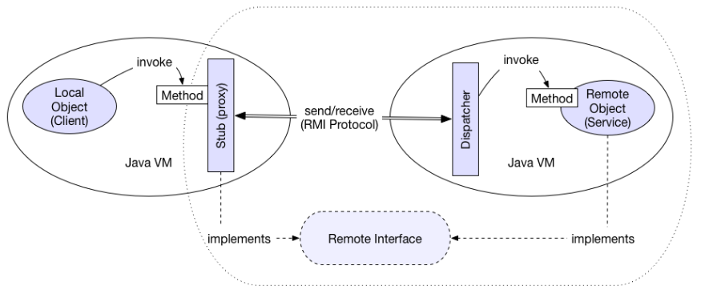

# Distributed Object Systems

Java has Remote Method Invocation (RMI), designed to invoke remote methods on remote objects as if they are local.

The server creates a set of remote objects, makes references to these objects accessible and waits for client requests to invoke methods on these objects.
The client obtains remote references and invokes methods on remote objects.

Java.rmi provides a Java API to support dist. obj. programming. It has registry services for advertising, look-up of remote obj. ref. It also has distributed garbage collection.

In a distributed obj. app, you have:

* Lookup/locate
  * RMI naming service, implemented as rmiregistry application
  * Remote references many be passed as parameters
* Proxies
  * Called a stub managed communication with server on client side
  * Method invocation appears identical to local method calls
* Class loading
  * Java objs. instantiated from compiled classes
  * RMI allows class loading from remote sites
  * Needs serialisation, transmission of specifications

``` java
package comp2207.shout;
import java.rmi.registry.LocateRegistry;

public class ShoutClient {
    public static void main(String[] args) {
        String host = args[0];
        try {
            Registry reg = LocateRegistry.getRegistry(host);
            ShoutInterface sb = (ShoutInterface) reg.lookup("Shout");
            BufferedReader in = new BufferedReader(new InputStreamReader(System.in));
            System.out.print("Enter message");
            System.out.println(sb.shout(in.readLine()));
        }
        catch (RemoteException e) {
            // do something sensible (catch other exceptions too)
        }
    }
}
```

Two fundamental concepts:

* Remote object reference
  * Methods on remote object only invoked if calling obj. has remote ref.
  * Ref. provided by a registry
* Remote interface
  * Every remote obj. has remote interface
  * Specifies what methods can be invoked remotely
  * Class specification, from which remote objs. instantiated, must implement interface

``` java
package comp2207.shout;
import java.rmi.Remote;
import java.rmi.RemoteException;

public interface ShoutInterface extends Remote {
    public String shout(String s) throws RemoteException;
}
```

## Stub

* A remote obj. treated differently when passed from one JVM to another
  * Remote ref. passed to received JVM
  * Stub created by infrastructure in client's JVM
  * Dynamically created at runtime
  * Stub implements same methods as on remote obj.



``` java
package comp2207.shout;
import java.rmi.RemoteException;

public class ShoutImpl implements ShoutInterface {
    public ShoutImpl() throws RemoteException {}
    
    public String shout(String s) throws RemoteException {
        return s.toUpperCase();
    }
}
```

To deploy remote app., need to generate instances of remote obj. to run on server.
Export them and obtain stub. Register them with local registry.

Registry runs on same machine as server, on seperate JVM. Listens on specific port for reg/lookup.
Maintains binding of URLS to refs of remote obj.

```java
void rebind(String url, Remote obj)
void bind(String url, Remote obj)
void unbind(String url, Remote obj)
Remote lookup(String url)
String[] list()
```

## Remote Implementation

``` java
package comp2207.shout;

import java.rmi.RemoteException;
import java.rmi.registry.Registry;
import java.rmi.registry.LocateRegistry;
import java.rmi.server.UnicastRemoteObject;

public class ShoutMainline {
    public static void main(String[] args) {
        try {
            ShoutImpl serv = new ShoutImpl();
            ShoutInterface stub = (ShoutInterface) UnicastRemoteObject.exportObject(serv, 0);
            Registry reg = LocateRegistry.getRegistry();
            reg.rebind("Shout", stub);
        }
        catch (RemoteException e) {
            System.err.println(e.getMessage());
        }
    }
}
```

With the stub, we are downloading code from a remote server to run on our machine. This is a terrible, terrible, terrible idea. We need a security manager and a sensible security policy.

The security manager sets up a sandbox in which the code is run. The ``SecurityManager`` class is in ``java.lang``.

``` java
if(System.getSecurityManager() == null) {
    System.setSecurityManager(new SecurityManager());
}
```

We tell the JVM the policies:
``System.setProperty("java.security.policy", "mypolicy");``

We need to consider where the code is coming from, what we expect to permit and deny and if we expect the code to be digitally signed.

We may have many clients requests to deal with at the same time. A new thread handles each requeust, so our remote obj. may be handling multiple calls on multiple/the same method at once. We need to avoid race conditions.

We want to safeguard performance of linked actions by a single thread. We can do this through atomicity and guaranteeing mutual exclusion. We can achieve this in Java with monitors.

``` java
public class RegImpl implements RegInterface {
    private Map<String, Remote> _map = Collections.synchronizedMap(new HashMap<String, Remote>());
    
    public synchronized void bind(String name, Remote obj) {
        if(_map.containsKey(name)) {
            throw new AlreadyRegisteredException("You dumb");
        }
        _map.put(name, obj);
    }
    
    public void rebind(String name, Remote obj) {
        _map.put(name, obj);
    }
    
    public void unbind(String name) {
        _map.remove(name);
    }
    
    public synchronized Object lookup(String name) {
        if(_map.containsKey(name)) return _map.get(name);
        throw new NoSuchServiceException("Not found");
    }
}
```

Java RMI assumes that both client and server run in a JVM.

We need a common language to pass information around if we have different languages.