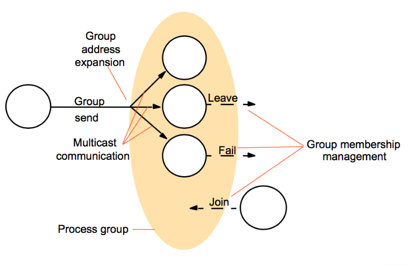
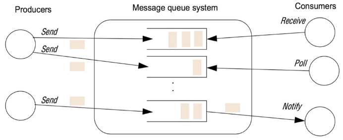
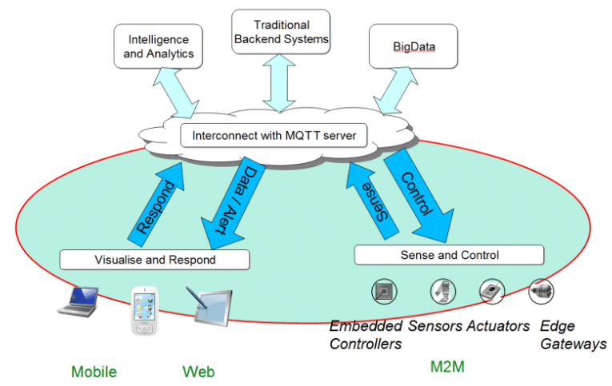

# Loose Coupling

Aim to remove dependency on specific lang. Can we also relax coupling between client and server at the same time?

We can communicate through an intermediary. We need to introduce infrastructure components that:

* Allow senders/recipients of message to be decoupled with respect to (wrt) identity
* Allowing sending/receiving of messages to be decoupled wrt. lifetime
* Allow for more flexibility (easier to replace, restart component)

|                     | Time Coupled                                                 | Time uncoupled                                               |
| ------------------- | ------------------------------------------------------------ | ------------------------------------------------------------ |
| **Space coupled**   | Communication directed towards given receiver.<br />Receiver must exist at that moment in time<br />Message passing, remote invocation | Communication directed towards given receiver<br />Sender/receiver can have independent lifetimes |
| **Space uncoupled** | Sender does not need to know identity of receiver<br />Receiver must exist at that moment in time<br />IP Multicast | Sender does not need to know identity of receiver<br />Sender/receiver can have independent lifetimes |

Space uncoupled: Participants can be replaced, updated, replicated, migrated, etc.
Time uncoupled: Senders/receivers may come and go. Useful for mobile env.

S&T uncoupled: Useful for dissemination in systems where receivers unknown/liable to change (event feeds in financial systems)

## Group Communication

Message sent to group. Sender unaware of receivers. Usually implemented via IP multicast, with guarantees added.
Applications: reliable dissemination of info to large number of clients, collaborative apps, consistent update of replicated data.

Single multicast may be more convenient for programmer and more efficient. Infrastructure may offer better reliability and support message ordering.
May have different type of groups.

### Synchronous vs Asynchronous

Synchronous systems:

* Real-time diffusion of messages to group
* Requires bound on communication delays, process scheduling delays and faulty components
* Requires sufficient redundancy in communication paths between processes

Asynchronous systems:

* Message exchange via datagram
  * Message can get lost
* We require bounds on timeout delays
* Assume timely communication most of the time

### Implementation Issues

Reliability:

* Integrity - message is identical to one sent
* Validity - every message eventually delivered
* Agreement - if message delivered to one member, delivered to all

Ordering:

* FIFO
* Causal ordering - Causality order between messages preserved
  * e.g. message $m_2$ sent in response to $m_1$ received by all members after $m_1$
* Total ordering - all messages delivered to all processes in same order, regardless of causality



We need an interface for group membership management:

* Create/delete group
* Add/remove process from group

Need failure detection:

* Monitor group members
* Respond to process crashes or unreachable members

Need to notify group members of membership changes and perform group address expansion prior to message delivery.

## Publish-Subscribe

Publishers publish events to an event server.
Subscribers express interest in particular events.

System delivers event notifcations
Applications:

* Financial information systems
* Cooperative working systems
* Monitoring applications
* Asynchronous, cloud-based workflows
* Google adverts

Events are published to topics advertised by publishers. Topic subscribers are notified of events via messages. If a subscriber is not running, events queued till it rejoins.

Sub models:

* Channel-based
  * Events published to named channels
  * Subs receive all events sent to channel
* Topic-based
  * Events contain topic info
  * Subs identify topics of interest
* Content-based
  * Subs use queries to define content-based filters

Implementation models:

* Centralised
  * Single broker interacts with pubs/subs via point-to-point messages
  * Lack of resilience and scalability
* Distributed
  * Network of cooperating brokers, federated
* Peer-to-peer
  * Some fully peer-to-peer implementations possible

## Message Queues

Provides indirection: S&T uncoupling
A point-to-point server. Sender places message in queue, single receiver removes message from queue. Loose coupling suitable for integrating applications within an enterprise.



### MQTT

Emitting information one-to-many. Listening for events whenever they happen. Minimal packets of data in huge volumes. Pushing info over unrelliable networks.



Topics define the namespace hierachically, with sub-topics separated by "/".
e.g. smart home publishes:

```
<town>/<postcode>/<house>/alarm
<town>/<postcode>/<house>/temperature
<town>/<postcode>/<house>/energyUse
```

and subscribes to:

```
<town>/<postcode>/<house>/thermostat/setTemp
```

Subscribers can use wildcards:

Single-level wildcards ``+`` anywhere in topic string. Multi-level wildcard ``#`` at the end of the string.

A sub can be (non) durable. Durable means messages are forwarded immediately if sub connected, next time sub connected if not. Non durable means it remains as long as sub is connected.

A pub can be retained. Publisher can mark publications as such. Broker remembers last known good message on a topic. Broker gives last known good message to new subs.

### Constrained Networks

Protocol compressed into bit-wise headers and VLF.
Smallest packet size: two bytes.
Asynchronous bidirection push - no polling!
Supports always-connected and sometimes-connected models.

Has session awareness with a configurable keep alive. With a failure, have a 'will'.

## RabbitMQ

Offers scale and flexibility, as it is a 'polyglot.' It has support for multiple underlying protocols. It can enable numerous communication patterns.