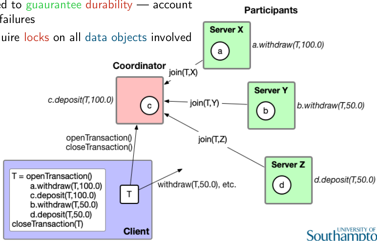
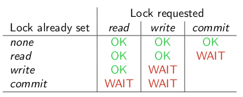

# Distributed Transactions

Data may be distributed, functionality may depend on data across multiple servers.
We need the system to satisfy ACID properties:

* Atomicity - either transaction completes successfully or has no effect at all
* Consistency - transaction takes sytem from one consistent state to another
* Isolation - intermediate effects no visible to other transactions
* Durability - effects are persistent

We need transaction middleware that enables transactions that may be distributed to maintain the ACID properties
Need to be recoverable
Client needs to be able to signal start/end of sequence of dependent operations
Need commitment process that guarantees all operations permanently recorded
Protocol needs to ensure aborted transaction leaves no effects in either objs. involved or in storage

We can have something known as the lost update problem. It is very similar to race conditions.

The solution is ensuring serially-equivalent interleaving. The combined effect is as if the transactions had been performed one and the other. It prevents lost updates and inconsistent retrievals.
The schedule produced by a concurrnency control scheme must be equivalent to a serial schedule.

Transactions must be serialised in their access to objects. Can be done by locking or optimistic concurrency control (transactions proceed to commit, server checks for conflicts with other transactions, aborts if necessary) 

## Dirty Reads and Premature Writes

Dirty reads happen when another transaction reads a value you've set in your transaction, and you then abort your transaction.
We need recoverability. Delay commits till commitment of all transactions who uncommited state observed.
To avoid cascading aborts, allow transactions to only read objects only from committed transactions.

Premature writes means trying to write over something that has been overwritten by another concurrent transaction.
Delay writes until earlier transactions that updated the same objects have either committed or aborted.

## Distributed Commit Protocols

We need to guarantee atomicity - all or nothing
Need to guarantee durability - account for failures
Require locks on all data objects involved

We need to elect a leader through a leader election.
We need a consensus protocol to decide if to commit or abort.

### Single Phase Commit

The protocol:

* Coordinator says commit
* Participants acknowledge

Coordinator keeps repeating commit request until all acknowledged.
How long do you wait? What if one participant fails?

### Two-Phase Commit

Voting scheme to reach consensus.
Preserves atomicity: if one op aborted, transaction aborted. Requires reliable message delivery.
Has a unilateral abort: servers can unilaterally abort if this can be detected by coordinator.

#### Phase 1: Voting

Coordinator asks all participants, can you commit?
Check all participants:

* if local decision yes, save state to local storage, respond with yes
* if no, abort local op, release locks, respond with no

#### Phase 2: Completion

Collect all votes:

* if all votes yes
  * tell participants to commit
  * participants respond with if they've committed
* if one says no
  * tell participants to abort

### 2PC Failure Recovery

#### Participant Failure

If the participant crashes after saying yes, the state is saved to local storage. Use this to reinstate an equivalent participant. Call ``getDecision()`` on the coordinator to understand whether is should commit or abort. Follow the decision.

#### Coordinator Failure

If coordinator crashes in 2nd phase, 2PC can become blocking protocol. Participants can get ``getDecision()``. They are left in an uncertain state with locks in place.

The sensible thing to do would be to elect a new coordinator, who then issues abort messages. Recovery from failure can take time.

## Two Version Locking

Can increase concurrency through sharing locks of reads with many readers and a single writer.
Shared read will have to wait to promote lock to write.
Transactions can write tentative versions of objects, the others read from the committed version.
Read operations are delayed during commitment and read operations on one transaction can delay commitment of others.

Locks have an overhead. There can also be a deadlock, where there is a loop in a locking graph. You could break out of it with timeouts, probes, etc.