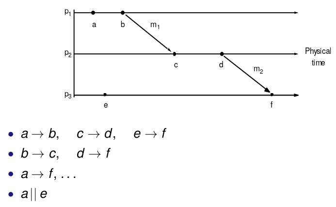

# Distributed Algorithms Part I: Time

Need algorithms for inter-process coordination and agreement.

The timing of events is important. We need to consider failures in algorithm design, as well as the distinction between asynchronous and synchronous systems.

## Time in Distributed Systems

Some distirbuted algorithms/applications depend on clock synchronisation:

* Full synchronisation
  * Not possible, but accuracy within certain bound can be achieved
* External synchronisation with external source of time $S$
  * $|S(t)-C_i(t)| < D \text{ }\forall \text{ }i$
  * Can be achieved using a time server
* Internal synchronisation
  * $|C_i(t) - C_j(t)| < D \text{ }\forall \text{ } i,j$
  * Can use an internal coordinator

Other distributed algorithms only rely on info about time ordering of certain events. Logical clocks are sufficient for this.

### Synchronisation in Synchronous System

Assume bounds on message transmission delay nad time to execute process steps.
To achieve internal sync between two processes, one process sends its time $t$ to process in a message. The receiving process sets its time to $t + \frac{\text{max} + \text{min}}{2}$. Max and min are the respective max and min times needed to transmit a message.

### External Sync with Christian's algorithm

Time server process supplies time according to its clock. 
Process $p$ updates it times to $t + \frac{T_\text{round}}{2}$, where $T_\text{round}$ is the time taken by the request and reply. Several requests improves the accuracy of the estimation. Severl time servers can improve availiability and accuracy of estimation.

### Internal Sync with the Berkeley algorithm

One machine chosen as *master*. Periodically, master polls other machines for their clock values. The master estimates local times based on round trip times, averages the values (including its own).

Master then sends the amount by which processes need to adjust their individual times, and not the new clock value.

### Network Time Protocol

NTP allows clients across Internet to be accurately synchrnoised to UTC.
NTP service provided by network of servers, organised into levels.

Primary servers connected directly to a time source.
Secondary server synchronise with primary ones.
...
Can use multicast or Christian's algorithm for sync at each level.

## Logical Time

Need to known if event at one process occurred before, after or concurrently with another event in another process.
Can use event causality to obtain partial ordering of events.

Define $a \rightarrow b$ (a happened before b) as:

* if $a$ and $b$ are events in the same process, and a occurs before b, then $a \rightarrow b$
* if a is the event of message send from process A, and b is the event of message receive by process, then $a \rightarrow b$
* if $a \rightarrow b$ and $b \rightarrow c$, then $a \rightarrow c$

$\rightarrow$ is a partial order (reflexive, transitive, antisymmetric). We assume $a \rightarrow a$ holds

$a$, $b$  concurrent (written $a || b$) if neither $a \rightarrow b$ and $b \rightarrow a$

### Lamport's Logical Clocks

Each proces $p_i$ keeps own logical clock $L_i$, use it to timestamp local events
Process updates logical clock and transmits their values in messages:

* $L_i$ incremented before assigning timestamp to event
* When $p_i$ sends message $m$, timestamps it with current $L_i$, piggybacking $t = L_i$ on $m$
* On receiving $(m,t), p_j$ computes $L_j = max(L_j, t)$ before incrementing $L_j$, timestamping event $receive(m)$

### Totally Ordered Logical Clocks

Distinct events in different processes may have identical timestamps
Achieve total order by incorporating process identifiers:

* Global logical timestap of event $e$: $(T_i, i)$ where:
  * $T_i$ - local timestamp
  * $i$ - process timestamp
* Define $(T_i, i)$ < $(T_j, j)$ if:
  * $T_i <T_j$
  * or $T_i = T_j$ and $i<j$

### Vector Clocks

Vector clock for a system of $N$ proccesses: array of $N$ integers
Each process $p_i$ keeps its own vector clock $V_i$, uses it to timestamp local events
Timestamps are attached to messages and updated upon receiptof messages

Updated as follows:

* initially $V_i[j] = 0 \text{ for all } i,j$
* $V_i[i]$ incremented before $p_i$ timestamps event
* When $p_i$ sends message $m$, it timestamps it with current value of $V_i$, piggybacking $t=V_i$ on $m$
* Upon receipt of message $(m,t), p_i$ computs $V_i[j] = max(V_i[j], t[j]) \text { for all } j$ before incrementing $V_i[i]$ and timestamping the event $receive(m)$

Comparing vector timestamps:

* $V=V'$ iff $V[i] = V'[i]$ for all $i$
* $V \leq V'$ iff $V[i] \leq V'[i]$ for all $i$
* $V<V'$ iif $V \leq V'$ and $V \neq V'$

We have $a \rightarrow b$ implies $V(a) \leq V(b)$, but also have $V(a) \leq V(b)$ implies $a \rightarrow b$
Storage and message payload proportional to $N$.