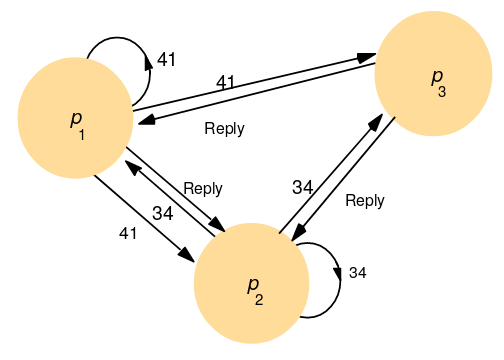

# Distributed Algorithms Part II: Distributed Mutual Exclusion

Assume reliable communcation channels between processes.
Failed links between process eventually repaired/circumvented

Processes only fail by crashing (no Byzantine failures)
Assume we can build failure detectors.

## Failure Detectors

Service that processes queries regarding process failure. Uses local failure detectors, one for each process.

Processes only fail by crashing. No arbitrary failures!

Assume a reliable communications channel between processes - eventually delivered messages.
Failed links eventually repaired or circumnavigated.

### Unreliable Detectors

Return hints: Unsuspected and Suspected
Most practical systems implement this

### Reliable Detectors

Return hints: Unsuspected and Failure

## Distributed Mutual Exclusion

We need to provide critical region in distributed environment.
Use only message passing.

We assume:

* $N$ proccesses
* Network is reliable by async
* Processes do not fail
* Process spend finite time in critical area

Correctness defined with:

* Safety
  * At most one process executes in critical section at one time
* Liveness
  * Requests to enter/exit eventually succeed
* Fairness
  * Accesses to critical section in happened-before ordering ($a \rightarrow b$) of requests

Performance defined by:

* Minimise number of messages sent in each entry/exit ops
* Minimise client delay when entering/exit critical section
* Minimise sync delay

## Central Server Algorithm

Server keeps track of token - permission to enter region
To enter region, send REQUEST, wait. Grants if server has it, otherwise queued
To leave, send RELEASE. Server grants to next process is queue

It has safety and liveness, but does not guarantee happened-before ordering.
There is a single point of failure, the server is the bottleneck and they must elect the server.

## Ring-Based Algorithm

Proccesses arranged in logical ring
Pass token around ring - $p_i$ sends meesage to $p_{(i mod n) + 1}$.
Enter if holding token, wait otherwise.

Safety and liveness guaranteed, but does not guarantee happened-before ordering.
Constantly consuming bandwidth by keeping the token circulating.

## Multicast and Logical Clock Algorithm

Process multicast REQUEST for token
Enter only if all other processes reply
Use totally ordered timestamps: $(T, p_i)$ included in request
Process replies only to requests later than own



```
On initialisation
	state = RELEASED;
	
To enter critical region
	state = WANTED;
	multicast request;
	T = request timestamp;
	Wait till no. of replies = N-1
	state = HELD;
	
On receiving request (Ti, pi) at pj (i != j)
	if(state = HELD or (state = WANTED and (T, pj) < (Ti, pi)))
	then
		queue request from pi
	else
		reply to pi
	
To exit critical region
	state = RELEASED
	reply to queued requests
```

Holds safety (if procces has state held, doesn't reply till exit), liveness (total ordering ensures each req. eventually gets all replies) and happened-before ordering (process with lowest timestamp gets all N-1 replies first)

No token keeps circulating, but big entry overhead. Can have a big exit overhead, send N-1 messages.

### Maekawa's Voting Algorithm

Don't need all N-1 replies.
Consider processes A, B, X.

* A needs replies from B, X
* B needs replies from A, X
* If X only replies to one at a time then
  * A and B cannot have a repy from X at same time
  * Mutex hands on X

Place processes in overlapping groups. The members of overlap control the mutex.
One group for every proccess.
Groups for A, B overlaps = mutex(A,B)
Every possible pair of groups overlap => mutex(all possible pairs) => mutex(all processes)

### Groups and Members

One group for every process. N proccesses, N groups.

Each group has K members. No. of groups to req. perm from.
Each process in M groups (M > 1). No. of processes to grant perm. to. Allows overlap => mutex.

The optimal solution is where $K = M \approx \sqrt{N}$. Non-trivial to construct groups.
An approximately can be where $K = M \approx 2 \times \sqrt{N}$. Easier to construct groups.

Assume nine processes. Arrange into matrix.
$\begin{matrix}a&b&c\\d&e&f\\g&h&i\end{matrix}$

Group for P obtained by union of row and column containing P.

Group of processes $V_i$ for each process $p_i$
To enter region:

* Send REQUESTs to all in $V_i$
* Wait for VOTEs from all in $V_i$

To exit:

* Send RELEASE to all in $V_i$

```
On initialisation
	state = RELEASED;
	voted = FALSE;
	
To enter critical region
	state = WANTED;
	multicast request to Vi;
	Wait till no. of replies = K
	state = HELD;
	
On receiving REQUEST from pi at pj (i != j)
	if(state = HELD or voted = TRUE)
	then
		queue request from pi
	else
		send VOTE to pi
		voted = TRUE
	
To exit critical region
	state = RELEASED
	multicast RELEASE to all in Vi
	
On receiving RELEASE from pi at pj
	if(queue of requests non-empty)
		remove head of queue (pk)
		send VOTE to pk
		voted = TRUE
	else
		VOTED = FALSE
```

This algorithm has safety (no process can vote for more than one process at a time)
Does not have liveness (deadlock can occur) and does not have happened-before ordering. Lower entry and exit overheads.

