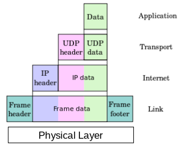
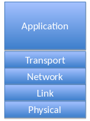

# Link Layer

There is an abstraction between what is happening at the application and the other layers.
Imagine the physical layer as the wires, Ethernet, 3G/4G protocol, WiFi protocols, etc.

All these things have different names. There is no one solid layer naming convention. We will be using Tanenbaum's model throughout these notes.

Each layer adds its own headers. This becomes part of the payload for the layer below it. This is shown in the first image, where for instance the Application layer's data is made into the payload of the Transport layer, where the UDP header is added. That has an IP header added in the Network layer.

From our point of view, the packet travels down the layers from application to physicial and then goes back up through the server from physical to application again. The link layer shields upper layers from specific connection types.

Bits are transmitted using encoding schemes. For example, Manchester encoding, 8b/10b, etc. Transmission based on varying something over time, for example voltage or frequency, with sychronisation.
There are theories for the capacity of a link given parameters (Shannon's theory)

$C=B\text{ }log_2(1+\frac{S}{N})$

## Functions of Link Layer

Includes:

* Transmission of frames over physical media
  * Includes number of required features
  * Encapsulates IP datagrams into Link layer frames
* Receiving frames, passing IP datagrams up stack
* Detection, handling of transmission errors

"Like putting the final thing in an envelope with a stamp on it and then handing it off to the Physical layer." -Kirk

## Frames

Your packet will be encapsulated into a **frame**, which contains the original packet and extra fields added to aid transmission.

The frame will depend upon the physical layer. For example, you can have an Ethernet frame.

The reason why any of this stuff works is that transmission happens over a packet-switched network. It provides access for senders using a shared medium, where many senders are transmitting simulatenously.

## Flow Control

The Link layer has to manage slow receivers and fast senders, so it has to regulate the flow of data. Basically, it can be used to send messagers to a sender saying more data can be sent or less data should be sent. It can be rate-based so the speed is agreed, but it is rarely used in this low of a layer.

## Acknowledgements

Three models for link layers:

1. Connectionless, no ACKs
   * For low error rate networks
     * Wired Ethernet
   * No signalling path is established in advance
2. Acknowledged, connectionless service
   * Wireless 802.11
   * 802.11n supports block acknowledgments
3. Acknowledged, connection-orientated
   * For long delays, unreliable links

Different strategies available:

* Stop-and-Wait Automatic Repeat reQuest (ARQ)
  * Send frame, wait for ACK, send next
  * Will not get ACk if frame lost, damaged, etc..
* Go-back-N ARQ
  * Use sequence number to label each frame in flight
  * Send n frames of data, if ACK missed, retransmit
* Selective-Repeat ARQ

## Error Detection

Can provide line 'free of errors' to network layer. It requires errors or packet loss detection and subsequent retransmission. Other layers can have error detection.

Simple check is a parity bit
CRC - simple algorithm, better than checksum
Checksums occur at different layers. IPv4 has a checksum but IPv6 doesn't.

## Framing

Each sequence of link layer bits needs to be framed. Needed to indicate where frame starts and ends. There are various approaches to this problem.

* FLAG byte value to mark start and end
  * If FLAG occurs in data, using an Escape byte.
  * Strip first Escape 

## CSMA/CD operation

Like a telephone conversation. Sender listens to see if the media is busy. When the channel is free, the sender starts to talk. Back off before retransmissioning if collision detected.