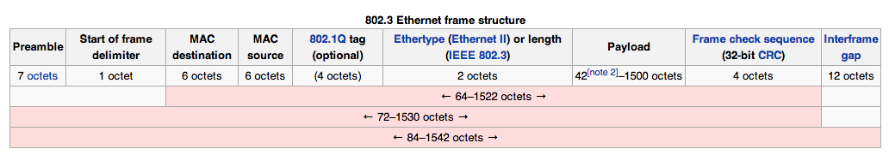
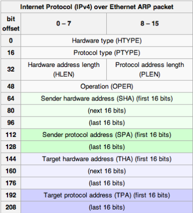

# Ethernet

An Ethernet frame includes 48-bit source and destination MAC addresses and a 802.1Q tag for optional VLAN ID and frame priority.

The Maximum Transmission Unit is usually 1500 bytes. Larger messages are broken down into multiple frames which are re-assembled by the receiver.
Remember, the MAC address is a link layer address. It is currently defined as 48 bits, but it can be extended to 64 bits. 24 bits are used for vendor allocations.

## Hubs, Repeaters, Bridges, Switches

With Ethernet, each host connects to a port in a concentrator device. Today's devices have 1 Gigabit connections. Servers will typically have 10 Gigabit connections.

Hubs and repeaters (which are old, do not confuse with broadband boxes) simply take frames in and send them out on each physical interface. All hosts see all packets.

Bridges and switches (which are current) receive Ethernet frames and make a decision whether to forward the frame, and if so, on which port. It provides 'smart' forwarding.

A switch is an 'intelligent' Ethernet forwarding device. It can store and forward Ethernet frames so that it can check for errors (CRC check) before forwarding.
It can *learn* Ethernet addresses of hosts seen on each switch interface/port. It creates a MAC table of devices seen on each switch port, which allows for smart forwarding for received Ethernet frames. It only forwards frames to address X to the switch prot where X is.

### MAC Learning

A switch observes *incoming source Ethernet addresses* on each switch port. It stores the observed MAC source address in the switch port table.

Then, it can forward future frames to that address to that port. Broadcast frames are still forwarded everywhere. Hosts only see traffic sent to them.

## ARP - Address Resolution Protocol

If a host sends an IP datagram over Ethernet, it needs to be able to determine the destination's MAC address. To find this, it uses the Address Resolution Protocol.

ARP uses a link layer broadcast message. The sender is essentially asking "Who has this IP address?". The sender can use the result of this to send an Ethernet frame. 

### Message Types

* Unicast
  * From sender to receiver
* Broadcast
  * From one sender to all potential receivers
* Multicast
  * From one sender to any number of interested receivers
* Anycast
  * One sender to nearest instance of receiver

### ARP Message Format

### ARP Cache

Hosts will cache ARP responses to avoid repeated lookups. It can be useful to check the cache when troubleshooting.

### Nuances

ARP is potentially open to spoofing. A host can change its MAC address.
Some low power devices 'sleep'. You can use Proxy ARP to answer for them.
If there is a change of IP or MAC address, you can send a 'gratuitous ARP' which enables a quick update of the correct information.
You can ARP probe to detect IP address clashes.

## IP Subnets

The admins of a network could assign an IP subnet to each LAN, which implies there is an IP address plan to determine which LANs use which IP address ranges. Address planning is an important task for network administrators. Such planning is an ongoing process, as new networks are added and removed.

## Spanning Tree (802.1d)

Allows for physical loops in the network without breaking the network. The algorithm decides a root bridge/switch and determines the least cost paths to the root, forming a tree of paths.

## Virtual LANs (802.1Q)

Used to create virtual switched networks over fixed infrastructure. Ethernet frames include an optional VLAN identifier (12-bit value within 802.1Q tag). It avoids the need to physically re-cable for another LAN. Can place one switch port in a different VLAN without touching cabling. You can put all staff in one group in one VLAN for instance.

## Ethernet Frame Priority (802.1p)

May want to give traffic priority in Ethernet networks. This is supported by using part of the 802.1Q tag. There bits of the tag are used to indicate the 802.1p priority, from 1 to 7. It only affects prioritisation at the switch.