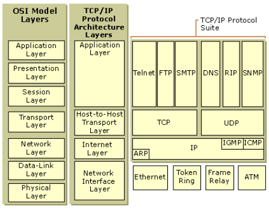
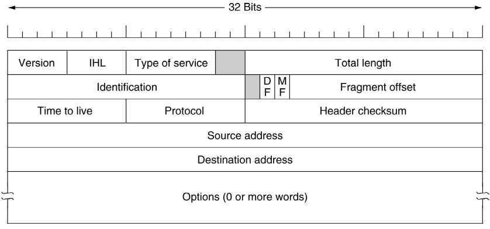
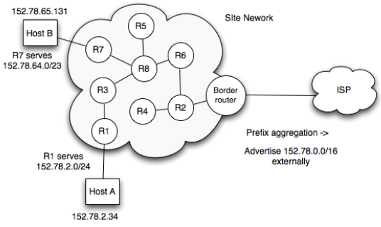

# Internet/Network Layer and IPv4

The Network layer deals with packets end-to-end. It will send packets via the Link layer, passes a received packet's payload to the correct Transport layer, provides unique addressing (IPv4/IPv6) and handles next-hop routing. Also, I should lock my computer 

There are two sets of names for this layer.

## Functions of Network Layer

Allows for internetworking. The Internet is a network of networks. Layer two LANs are at the edge of the network, with routers at the core of the network of networks.

The network layer does transmitting, where it packetises the Transport header and payload, adding an IP header and keeping the rest as a payload. It also processes and routes IP datagrams and does fragmenting where necessary, if the IP datagram size is greater than the MTU of the link layer.

When receiving data from the link layer, it does error checking and reassembly of fragments if necessary.

## IP properties

* IP is packed-switched and connectionless
  * IP packets are routed towards the destination at each router on the path
  * It is connectionless, so the packet goes from A to B
* Unreliable
  * There is no guarantee any given sent IP datagrams will be received
  * Routers by default forward only on best effort basis
* Routing
  * Based on destination IP address
  * Routers maintain routing tables to make route decisions
* Globally unique, delegated address
  * Must be globally addressable to initate IP traffic to them
  * Private address space may be used in sites

## Core Protocols

The five main protocols that operate at the network layer are:

* IPv4
* IPv6
* ICMP (for diagnostics, control)
* ICMPv6
* IPSEC (for security)

## Store-and-forward Packet Switching

The packet is sent to the nearest route, which passes it on until it eventually arrives at the destination. The network layer will hide the complexity of routers from the transport layer above.

### Unreliability

Routers forward the packets on a 'best effort' basis. IP packets may be dropped, usually due to congestion. With TCP, retransmissions are handled inherently. However, with UDP, the application layer is responsible for retransmission.

Quality of service methods can help by prioritising certain traffic. 

## IPv4 Packet Header

The IP layer takes segments of data from the transport layer and adds IP headers to create an IP datagram. The TCP header/data becomes the payload for the IP datagram.

In the header, there is:

* Source IP address
* Destination IP address
* Header length (IHL)
* Identification field and fragment offset
* Time To Live
* IP header checksum

## Fragmentation

IP datagram may be fragmented on its path if a link with a smaller link layer MTU is encountered.

Ethernet typically has an MTU of 1.5k bytes
In IPv4, hosts and routers can fragment the IP datagram.
It is preferable to avoid any fragmentation, but the identification field and fragment offset can allow for reassembly. It adds ineffiency and possible security issues.

## Maximising Use of Address Space

Number of methods to make more efficient use of IPv4 address allocation.

* Dynamic Host Configuration Protocol (DHCP)
  * IP addresses reused
* Network Address Translation (NAT)
  * Use private IPv4 addresses internally, global externally
  * Popular in home ADSL networks, comes with architectural price
* Classless Inter-Domain Routing
  * Use any prefix length, not just /8, /16, /24

## Subnets

We create IP subnets in campus, typically on per-building/department basis.
Various addresses associated with IP subnet:

* Subnet network address
  * First IP in range
* Subnet prefix length
  * For example, 24 bits
  * So 152.78.80.0 - 152.78.70.255 is 152.78.70.0/24
* Subnet mask
  * For example, 255.255.255.255
  * In full, 11111111 11111111 11111111 00000000
  * Conveys same info as prefix length
* Subnet IP broadcast address
  * Set all 1s in suffix
  * 152.78.70.255

