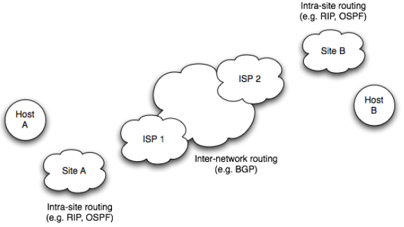
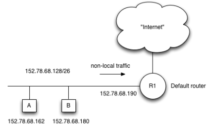
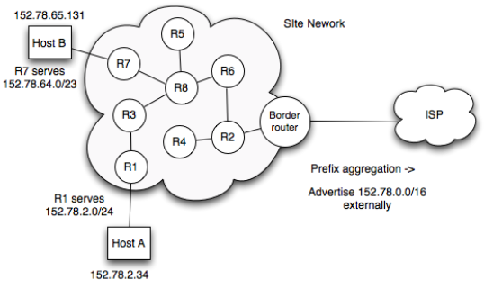
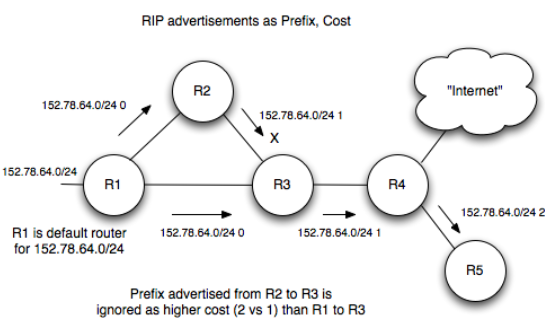

# Network Layer - IP Routing

We forward packets to routers which knows where to forward it, etc etc.

To determine where to deliver, host maintains small routing table.
Includes local subnet in which host resides.
Adds catchall default route.

IP packets not delivered locally goes via default router.
Default router needs knowledge of next router/subnet/link to forward packet to

To route in site:

* Can use static routes
  * Configure all routes manually
* Normally use dynamic routing
  * Using number of intra-site routing protocols:
    * Routing Information Protocol
    * Open Shortest Path First
    * IS-IS

Subnet network prefix can be aggregating hiding specific routes to other external networks.
External routers only need to know route to specific prefix, not to each /23, /24, /25 or smaller.

Types of routing protocol:

* DIstance Vector
  * Talk only to direct neighbouring routers
* Link state
  * Talk to all routers to establish full knowledge of topology

## RIP

One of original IP routing protocols
Uses hop count as metric. RIPng adds IPv6 support.

Router sends whole routing table periodically in messages to directly connected routers. Receiving routers use messages to update the view of best route to given network.

Each router keeps RIP routing table. Destination, cost, next hop for best path.

### Limitations

* Updates only every 30 seconds
* Metrics only suitable for smaller homogenous networks
* Slow to converge to steady state
* No knowledge of network topology

## Link State

De facto enterprise routing algorithm

1. Discover neighbours
2. Cost metric to each neighbour
3. Link state info packet made
4. Flooad message to all site routers in same area
5. Build topology from messages, compute shotest paths for prefixes served by given router

All routers know full topology.

Use Dijkstra's algorithm to determine shortest path through graph from initial node to given destination.

## Routing Between Sites

De facto protocol is Border Gateway Protocol (BGP)

Works with autonomous systems. Each ISP has unique AS number, assigned by RIRs.