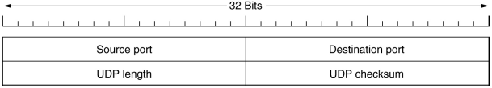
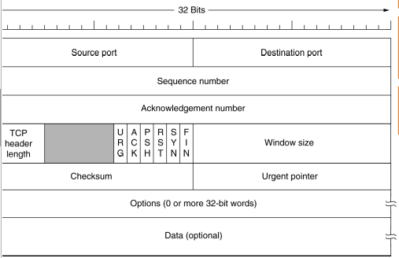
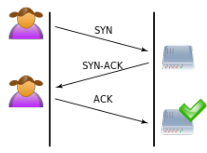
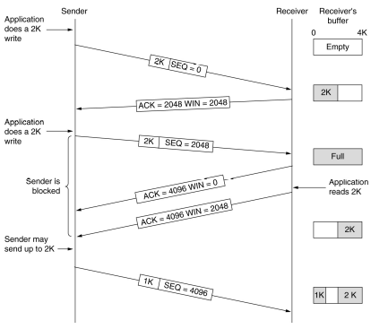
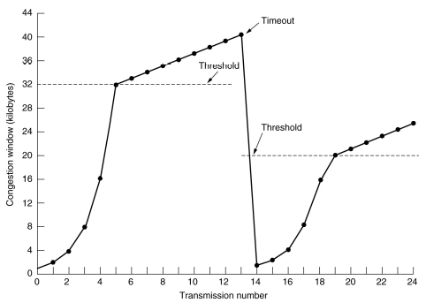
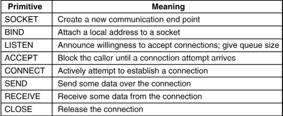

# Transport Layer: TCP, UDP

TCP/UDP are main transport protocols. IP packet protocol field in the header specifies which.

## UDP

User Datagram Protocol.

* Connectionless
  * Send a datagram to receiver
  * No seq. numbers, no ACKs
* Retransmission/adaptation up to application
  * May/may not be necessary to resend
* No flow control
  * Often fixed bit rate
  * Video streaming
* Low overhead
  * No connection management used
  * Less bandwidth for UDP header

UDP header much simpler that TCP (checksum optional, works as multicast).

Lossy/congested links can drop packet (higher protocols can send request back to source if needed)
Lower bandwidth links may drop packets as buffers fill up (applications can detect this, then tell server)

## TCP

Transmission Control Protocol

* Connection oriented
  * Similar to concepts in the link layer
* Includes ACKs and retransmissions
  * Unacknowledged segments resent
* Flow control/congestion control for segments it sends
  * Adapts sending rate to capacity of receiver
* Adjusts sending rate over time
* Receiver reassembles in correct order

Gives performance, reliability on otherwise unreliable IP service.

### Three-way Handshake

SYN, SYN-ACK, ACK
SYN opens the connection with the server (sent by client), SYN-ACK acknowledges the opening (sent by server) and then the client sends an ACK. The connection is now established.

ACKs are sent back by the receiver. The sender must detect lost packets by either a retransmission timeout (estimate when ACK is expected) or by cumulative acknowledgements (DupAcks) where an ACK acknowledges all past data chunks.

### Flow Control

Uses sliding window protocol to control sending rate. Receiver has limited memory to take packets off network and process them.
Sender should not send data unless receiver indicates it has buffer space to accept it.
Sliding window effectively the buffer space the receiver says it has available at any given time.

* Sender sends segment with seq. number and starts timer
* Receiver replies with segment with ACK number showing next seq. number it expects and its window size
* If receiver says window is 0, sender may send 1-byte probe to get new window

### Congestion Control

Maintained by sender. Indicates number of bytes a sender may put into network at any time.

* Packet loss is a signal of congestion
* Runs alongside sliding window
* Uses smaller of two windows when ending

Congestion window starts low

* Add one segment's worth per segment ACK before ACK timer goes off
* If successful, this doubles window every round trip

## TCP/UDP Service Model

Sender/receiver each create socket to act as communication endpoint
Socket has IP address and *port number*

Sockets and protocols used uniquely identify application's subsequent data transmission.

### Multiple Clients

Multiple clients will communicate with the same server. Each client endpoint will be different and the server multiplexes the connection (a thread per client endpoint).

## Berkeley Sockets API

Example of API to use sockets

- Server-side: socket(), bind()
- Client-side: socket(), connect()

