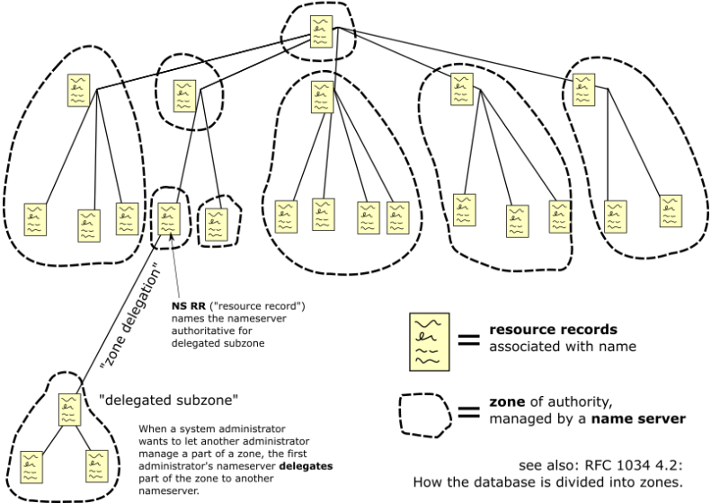
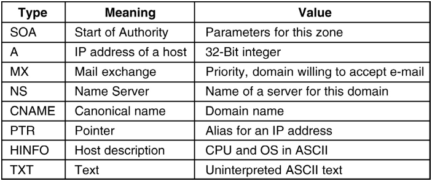
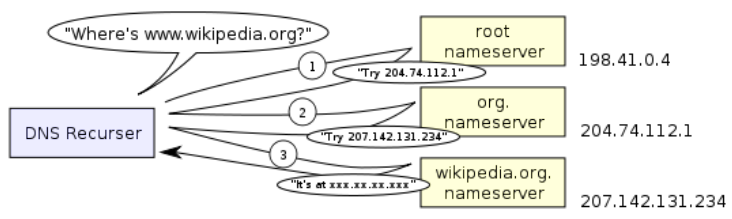

# Domain Name System

Domain names delegated from ICANN through Top Level Domain (TLD) registrars.
Allows sites/organisations to be delegated authority to maintain info about domains they have registered, and hosts/services in domains:

* the IP address of public-facing web server
* names of specific research machines

Most common DNS lookup is host-name to IP. Returns A record or AAAA record (IPv6) when queried. Implicitly requires that clients know IP addresses of local DNS server they can send queries to:

* may be ADSL router in home network
* DNS server run by iSolutions on uni campus
* public DNS servers

## Resolvers

Local DNS servers that hosts can send queries to. Client hosts configured to one (or more) DNS resolvers. ECS has internal-facing DNS resolvers. IP addresses usually provides to IPv4 host via DHCP.

Can use APIs to do DNS lookups, use command line tool to look at DNS entries. DNS queries usually UDP packets sent to name servers until answer is found. Resolvers cache results, and start with hints.

## Infrastructure

Campus will run its own DNS servers to act as resolvers for internally sourced DNS queries, either for internal/external names. Will also act as servers for external queries against internal names.

May provide split DNS view. Answers to internal sourced queries may be different to external queries.

## Managing DNS Entries

We can leverage hierarchical delegation structure. ICANN manages a number of root DNS servers, responsible for '.'.
Root servers where the DNS servers for each TLD are (.org, .uk, .com, .net, .no)

Each TLD servers knows where the name servers for delegated subdomains are. Known as DNS glue, mapping to specific DNS servers for domain.

DNS resolver can be configured with IP addresses for the root servers, then choose one to iteratively walk the hierachy from root to resolve lookups.

## Recursive DNS Lookup

First asks a root DNS server, then iteratively goes through delegated DNS hierarchy.

## DNS Caching

By using cache, client making queries can avoid hitting external DNS servers heavily. DNS records has Time-To-Live value (typically between 1 hour and 24 hours, tradeoff between DNS load and timeliness)

## Protocol

Can use TCP/UDP on port 53. By default, UDP. More efficient for small/fast lookups, the UDP messages originally limited to 512 bytes and were extended by EDNS0.

DNS is critical Internet infrastructure, therefore a target which people may attack. DNS needs to be resilient to such attacks (especially root servers). 

In principle there are only 13 root DNS servers but they are distributed across the world via anycast. There are multiple instances of each root server as a means to distribute a service and help spread genuine load and mitigate DoS attacks.