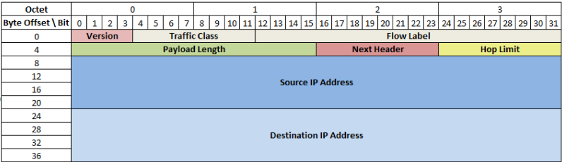

# IPv6

We are running out of IPv4 addresses. NAT, CIDR only helped so much.
IANA have no unallocated blocks.

128-bit addresses, rather than 32-bit like IPv4. 340 undecillion addresses. More than enoguh to give every grain of sand on Earth a global address.
Only 42 undecillion allocated in public pool currently.

2001:0630:00d0:f102:0000:0000:0000:0022
Leading zeros can be replaced.
2001:630:d0:f102:0:0:0:22
Can replace a block of zeros with ::
2001:630:d0:f102::22

Users shouldn't care, you shouldn't need to remember an IPv6.
Multicast is an inherent part of IPv6. IPv4 can co-exist via dual-stack deployments.

There are various scopes of addresses defined:

* Loopback
  * ::1/128
* Unspecified
  * ::/128
* Link-local addresses
  * fe80::/10
* Unique Local Addresses
  * fc00::/7
* Global Unicast
  * 2000::/3
* Multicast
  * ff00::/8

Smallest subnet you should be using is a /64

## Benefits

No need for NAT! Restores end-to-end connectivity.
More plug-and-play than IPv4. SLAAC works.
Streamlined header. More efficient routing and packet processing.
Fragmentation only at sender.

You should deploy now to gain familiarity before IPv6 becomes mandatory. You can secure IPv6 in your own 'IPv4 only' network. It enables early-adopters to access your services and supports new applications such as IoT.

You can have an extension header to sit after the IPv6 header but before the transport layer header in the packet. It implements the options field from the IPv4 header, fragmentation is moved to an extension header, extension headers can be daisy chained.

## Neighbour Discovery

Replaces ARP and ICMP router discovery.
Five ICMPv6 packets:

* Router solicitation
  * Request for router info
* Router advertisement
  * Router info
* Neighbour solicitation
  * ARP "who has"
* Neighbour advertisement
  * ARP reply
* Redirect
  * Router informs host of better first-hop

### Router Advertisement

Host sees or solicits router advertisement (RA). RA message carries IPv6 network prefix to use.
RA source address implies default router address. DNS server info can be included in RA.
Prefix info sent by multicast periodically or on request (router solicitation).

## Stateless Address Auto Configuration (SLAAC)

Hosts can autoconfigure basic network settings with DHCPv6 server.
Host using SLAAC builds address from:

* 64-bit prefix determined from RA
* 64-bit host part from MAC address

### Example

MAC address is 08:00:20:9c:14:66
Network prefix in RA is 2001:603:80:200::/64

The address is therefore 2001:630:80:200:0a00:20ff:fe9c:1466
fffe is added for 16-bit padding. 0a is the globally unique EUI-64 bit being set.

An IPv6 host can get its address and default gateway through RA.
Netmask is set at /64

### IPv6 Privacy Extensions

Uses a random 64-bit host part. Rnadomly IPv6 generated periodically and used for outbound connections. Still has SLAAC-configured address for inbound connections.

## Deploying IPv6

Dual-stack, where running both IPv4 and v6.
May need to rewrite/update existing applications, need to choose when to use v4/v6, requires v4 address space going forward and need a firewall for both protocols.

Can also have isolated IPv6 network.

### Translation

Can re-write IP header information as best as possible. Stateless IP/ICMP Translation uses IPv4 translated addresses in range ::ffff:0:0:0/96. 152.78.130.145 as ::ffff:0:152.78.130.145

Can use Application Layer Gateways, NAT64 (single IPv4 for IPv6 network), DNS64 (fabricate AAAA record for non-IPv6 sites that points to translator).

### Tunneling

6in4 encapsulates IPv6 packets in IPv4 packets. Used by tunnelbrokers.
Teredo encapsulates IPv6 in UDP IPv4. Use well-known IPv4 host on Internet to relay IPv6 traffic.
DS-Lite encapsulates IPv4 packets in IPv6 packets. Customer CPE only given IPv6.

## Barriers

Many home routers lack IPv6 support. Network admins lack desire to understand IPv6.
Regular users don't want to learn something new.
Chicken/egg situations with ISPs.

## Security Issues

IPSEC baked into IPv6.
Sheer number of addresses makes scanning less feasible.
Transition mechanism can bypass network security.
IPv6 implementation may still have undiscovered flaws.

IPv6 hosts can pick their own address. To track which devices where, poll switches/routers for MAC table, ARP table info.
Build database of mappings, switch port -> device MAC, MAC -> IPv4/v6 address.