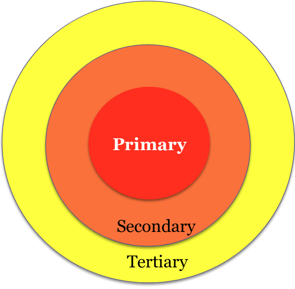

# Stakeholders and Personas

## Stakeholders Analysis

Who are the users?

* Primary Stakeholders
  * People who actually use the system
* Second Stakeholders
  * People who do not directly interact with the system, but provide input to it, or receive output from it
* Tertiary Stakeholders
  * People affected by the system, but do not directly interact
* Facilitating
  * People who are involved in the design, development and maintenance

## Personas and Scenarios

A lightweight method for capturing and recording the requirements of a system from an end user's viewpoint

A persona describes an end user in some detail:

*  Background
* Job Function
* Situation in the organisation
* Objectives, beliefs, anxities, etc...
* Often include representative image

Can describe variants of a particular roles (e.g. ideal student, laid back student, anxious student).
Personas are **not** real people! For each persona, we develop scenarios of their typical interaction with the model and/or other personas using said model.

Benefits:

* Users become tangible
  * Start thinking of software as solving needs of real people
* Different personas for same user
* Incorporate personas into stories
  * As a {persona} I want to {goal} so that {benefit}

Scenarios describe how a persona interacts with a system and other personas when using said system.
They are independent of technology, may represent either current practice or improve practice.
They typically reflect the domain 'as-is' (current practice).
Technology show-and-tell enables all members of a design team to be familiar with current technology used in the domain, and with new technologies that could create new opportunities.

