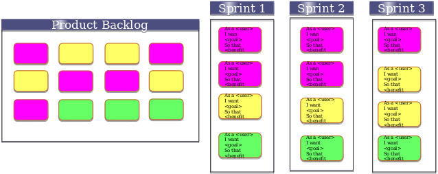

# User Stories, Sprint Planning and Risk

We are now on the part that we need to think about the requirements that the user will want.

A user story is one or more sentences in everyday/busineess language of the user that captures what the user wants to achieve.
They are small units of functionality, so make sure that they don't get too large.

Consider the three Cs of a user story:

* Card
  * Stories can be written on a notecard or post-it note
  * They can be annotated with estimates, other notes, etc...
* Conversation
  * Details from story come out during conversations with product owner
* Confirmation
  * Tests will confirm that the story was coded correctly

## User Story Template

As a {user} I want {goal} so that {benefit}

### Examples

As a hesitant 90s Internet user, I want to have an easy way to ask for what I want to find so that I don't have to just "know" where to go by remembering URLs.

As an academic I want to be able to find all of the papers and patents related to my area so that I don't spend three years in the library looking for them.

### INVEST in your user stories

Your user stories should be:

* Independent
* Negotiable
* Valuable
* Estimatable
* Small
* Testable

Remember the difference between a user story and a use case; a user story calls for a conversation, the use case documents the conversation.

## Agile Methods and Sprint Plans

We will be using the SCRUM method in Agile development.
In 100 words:

* Scrum is an agile process that allows us to focus on delivering the highest business value in the shortest time.
* It allows us to rapidly and repeatedly inspect actual working deliverables (every two weeks to one month).
* The business sets the priorities. Teams self-organize to determine the best way to deliver the highest priority features. 
* Every two weeks to a month anyone can see real working deliverables and decide to release it as is or continue to enhance it for another sprint.

SCRUM consists of a product backlog and sprint plans.

### Step 1: Envision your project

The SCRUM team and product owner begin by writing down everything they can think of for backlog prioritisation. There is almost always more than enough for a first sprint.

The product backlog is allowed to grow and change as morre is learned about the product and its customers. The product backlog is essentially the requirements for a system (Software Modelling and Design!)

### Step 2: Development Iteration

#### Step 2a: Prioritize

Use MoSCoW prioritisation. What *must* be done, *should* be done, *could* be done, and what would be nice but *won't* be done.
Prioritisation is the job of the product owner.

#### Step 2a: Plan Your Sprint

Collaboratively select the work to be done in the sprint. Work with the product owner on this, as they will identify what value this will deliver.

We must also identify how much of the backlog will be done in this sprint. This creates the Sprint backlog. A good starting point is to estimate lower level tasks and estimate the time it will take.

Consider what you should do in each sprint. You might not be able to do all the MUSTs as early as possible, as they may be dependent upon other MUSTS to be completed in a prior sprint.

Balancing tasks and stories is important to give a deliverable value. Also consider dependencies of user stories.

#### Step 2b: Sprinting and Measuring Progress

At least twice a week, but preferably every day, have a ten to fifteen minute meeting known as a SCRUM to assess our progress.

There is a SCRUM master, who makes notes and keeps the meeting on track.
Each team member will say:

* What they have done since the last meeting
* What they will do before the next
* What they need help with

You should assess the burndown of the sprint backlog.

#### Step 2c: Sprint Review Meeting

Consider:

* How the team did
* What the feedback was from the customer
* What changes in response to that feedback need to be taken forward and put into the next sprint

Use these metrics to reprioritise and plan the next sprint.

## Risk Analysis

Risk is an important factor in project planning and must be taken care of.

We establish the objetives of the product at this stage, identify constraints and risks, and then quantify the risks.

You can then identify alternative strategies and decide on strategies to overcome risks.
Consider the probability of the risk, severity of the risk, and then the risk exposure (probability x severity).