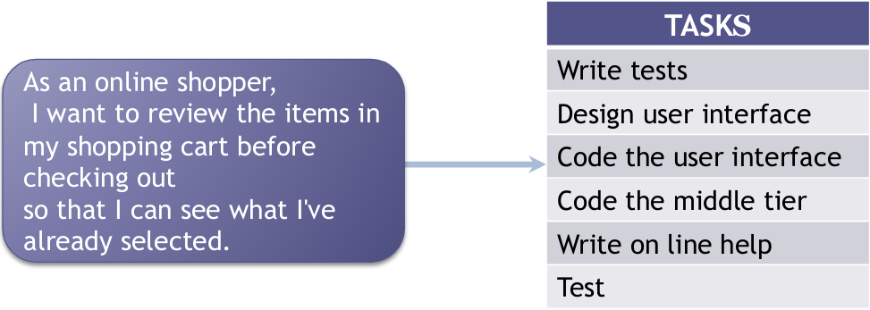

# Planning: From Backlog to Sprint Plan

We start with a prioritised backlog (using MoSCoW prioritisation). How do we decide what should be in a sprint?

The product backlog is delivered in increments of functionality. The increments are built in development sprints (design, build, test, fix). Consider planning horizons: the next sprint is up close and in detail and the next increments are further away and in less detail.

## Planning Sprints

The team collaboratively selects the work to be done in the next sprint. We work with the product owner, and figure out what value will this deliver to the increment.

We identify how much of the backlog will be done in this sprint and therefore create the sprint backlog.

* Start with the 'MUSTs' at the top of the prioritised product backlog
  * How many can you complete this sprint?
  * Create a cohorent deliverable that offers value
  * Avoid multiple product backlog items wrapping up the last few days of the sprint by mixing the size of the product backlog items you bring to each sprint
* Expand each product backlog item into one or more sprint backlog tasks so work can be shared in the sprint

### Considering Risk

Consider the risk of putting 'MUSTs' in the last sprint (may have to sacrifice important part of system if time runs out)
Consider if it is worth doing them all first (you need something of value to deliver and a sustainable workload!)

## Converting User Stories to Tasks

Identify the lower tasks that will be needed and estimate how long you think each will take.

Not all user stories are the same, as they may have different times to complete, different complexities.
Make a rough estimate for each task/story point before you build of how long it will take (S, M, L, XL). Check your estimate at the end and keep a record of your estimate and the actual t-shirt for each task.

At the end of the sprint, check your estimates. For each sprint from that point forward your estimates will be more accurate. Story points is an arbitrary measure used by Scrum teams to measure the effort required to implement a story. It is a number that tells the team how hard a story is.

## Agile Planning Poker

Estimating technique

* Fosters collaboration by engaging entire team
* Creates consensus estimates rather than having single person decide for the team
* Uses knowledge and experience of the whole team
* Promotes shared understanding of what is being built
* Exposes issues early through discussion

### Game

* Each participant gets deck of estimation cards representing sequence/numbers
* Moderator presents one user story at a time
* Product owner answers any questions the team might have about the story
* Privately select card representing their estimate of size of the story
* When ready, all cards presented
* In event that estimates differ, high/low estimators defend their estimates
* Briefly debate the arguments
* New round of estimation
* Continue until consensus

