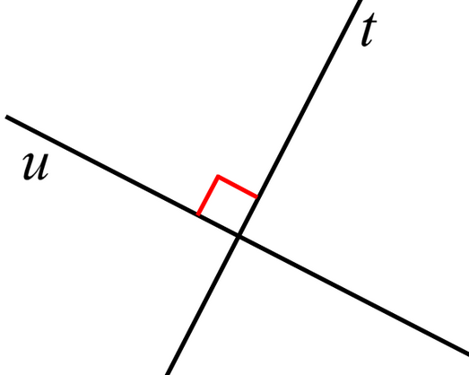

# Introduction

## Coursework

40% of module mark
Specification released in two weeks time
Done in pairs.
Will need to write Haskell code.

Design a programming language that can solve these problems.
Won't need to be Turing complete.

## Exam

60% of module mark

## Reasoning for Programming Language Concepts

Focus on programming languages as a field itself, rather than a specific language.
Higher level point of view on languages.
Be able to choose the right language for the job.
Be able to learn new programming languages
​	Technology constantly changes
Be able to better use a known languages

## Application Domains

Scientific computation
​	Fortran for mathematics
​	Mathematica, MatLab
​	OCAML, Haskell

Business applications
​	COBOL
​	BPEL, web services

## Readability

Simplicity in eye of beholder. Very qualitative criteria.
Most people actively fight against learning new things. 

### Orthogonality

With orthogonal lines, they are perpendicular lines that do not affect each other. Complementary and independent.

The same line of thinking can be applied to programming languages. Orthogonal features are not aware of each other and work seamlessly with each other.

C provides a good example of non-orthogonality. Arrays cannot be returned by functions in C, so there can be confusion between pointers and array types, and so on.

There is a difference between feature multiplicity and syntactic sugar. Feature multiplicity is the idea that you can complete one thing through many different methods, but syntactic sugar is the simplification of a method to something that makes the readability of the program better.

## Abstraction

Hide away low-level details from programmer. Get them to focus on the logic and solve problems in some coherent way. Programming has progressively become more high-level. Not many if not no programmer today understands the complexities of modern hardware today (pipelining, memory models, multi-core, etc...).

Dijkstra's paper "GOTO considered harmful"

Spectrum code (!!!)
10 PRINT "HELLO"
20 GOTO 10

## Efficiency

Some language features difficult to implement efficiently, or makes it difficult to *profile* code.
A good compiler will often do a better job of optimising your code than you could. C has some brilliant optimising compilers and will do a much better job than a human ever could at optimisation.