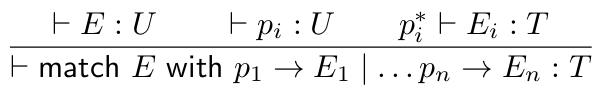

# Structured Types

To check that programs are doing what we want, can at least specify behaviour of data in different shapes and sizes in terms of the shape of the data they manipulate.
Structured types can make distinction.

Catch common programming errors where data being passed to function or library call is in different format to what is expected.

## Boolean

```
match b with true -> ... | false -> ...
```

Pattern match over each of these!

## Unit Type

Has exactly one value, written as (). Write type as unit.
This is type of Java methods with no parameters.

Can be used to suspend evaluation of expression till later point in computation.

```
let x = print "Hello" in ..x.. ;;
let x = fun () -> print "Hello" in ..x().. ;;
```

Former prints Hello, goes on with evaluation. Latter wraps print in function for later use. Process of wrapping expression with function of unit type is thunking.


## Pairs and Tuples

Given two pieces of data, of type $T$, $U$, can form piece of data of shape $T \times U$.


Straightforward to generalise this to arbitrary tuples:


### Destructors and Projections

First projection is fst, returns first component of pair. Second is snd. Returns second. Magic!


Can also use pattern matching:

```
match E With (E1, E2) -> ...
```

For generalised n-tuples, we need n projection functions.

## Record Types

Collections of n elements of data indexed by integers. Could use labels to index items. Known as a record, used extensively in C (struct) or Java (objects).
Syntax for record constructors:

```
{ L1 = E1, L2 = E2, ..., In = En }
```

Type of data of this shape:

```
{ L1 : T1, L2 : T2, ..., Ln : Tn }
```


## Sum Types

Sometimes we want a type representing the possibility of either type $T$ or $U$.
Known as a sum type. Written as $T + U$. Constructors of this type are called injections, known as inl and inr.


```
case E or inl x -> E1 | inr x -> E2
```

## Variant Types

Generalisation of sums.
Type of variants written:

```
< L1 : T1, L2 : T2, ..., Ln : Tn >
```

Constructors for type are injections named with labels:

```
< Li = E >
```


## Enumerations

Sometimes, you just want to write a variant type for its labels. For example, type for days of the week.

```
Data Day = Mon of unit | Tue of unit | ... | Sun of unit
```

Have the form:

```
< Mon = () >
```

etc.

Can only mix and match labels of type unit, with labels of non-unit types.

```
data Maybe a = Nothing | Just a
```

## Type Rule for Match

Similar to operator case - of - -> in Haskell.
The general form of operator syntax would be something like:

``` 
match E with p1 -> E1 | ... | pn -> En
```

where pn are patterns.



$p_i^*$ embodies assumptions about variables bound in pattern match. Requires type system for language of patterns (complex!)

## Lists and Arrays


## Non-Structure Type

Given type $T$, $U$, we can form $T \rightarrow U$. Functions from $T$ to $U$.
Higher-order functional languages can be any type at all.

