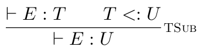
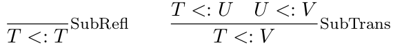
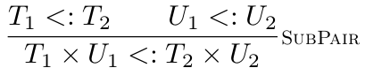
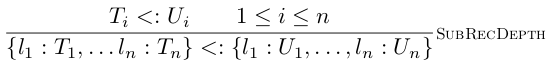
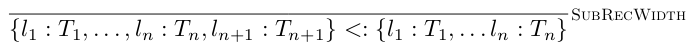
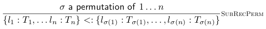
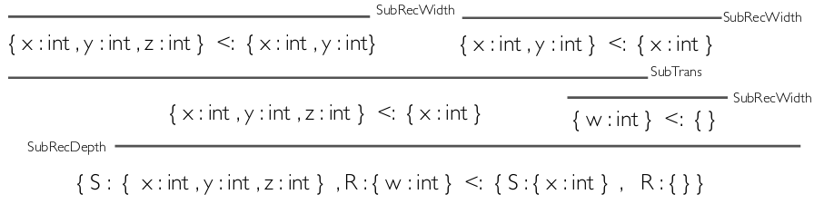
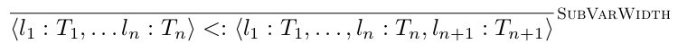
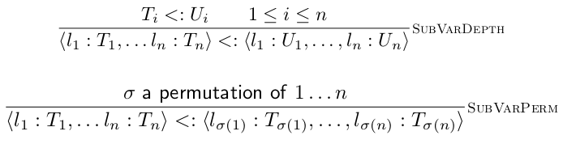
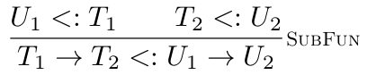

# Subtyping

There are different varieties of polymorphism:

* Parametric polymorphism (Java generics)
* Subtype polymorphism (Object oriented)
* Ad hoc polymorphism (Overloading)

We are talking about subtype polymorphism here.
We can think of types are sets and say that a type $T$ is a subtype of $U$, then in an interpretation as sets then $[[U]]$ is a subset of $[[T]]$.

$T$ is a subtype of $U$ if every operation that can be performed on $U$ can also be performed on $T$. This is structural subtyping.

We can declare, via inheritance, that one type is a subtype of other. This is actually called nominal subtyping.



 You can look at this as:

```
type T subtypes U = { ... }
class T extends U { ... }
```

Types are distinguished by their names - even if they represent the same structure. The labels can have different contexts.

We also need to define the relation to be reflexive and transitive.


## Structural Subtyping for Pairs and Records



Then structure determines the rest. For example, a subtype of the pair type $T \times U$ is a pair of subtypes of $T$ and $U$ separately.

We can generalise SubPair for records. This is depth subtyping.


We also have the notion of width subtyping in which there may be extra fields in the subtype.


We allow re-ordering of listed fields.


Example:


## Structural Typing for Variants





## Covariance and Contravariance

For example, if $T <: U$ and $V <: V$ then $T \times V <: U \times V$. The ordering between $T$ and $U$ is 'preserved'. This is a covariant type constructor.

Suppose we had a type former called $\text{Foo}$. Given type $T$, then $T \text{ Foo}$ is a new type.
If subtyping for $\text{Foo}$ is such that, if $T <: U$, then $U \text{ Foo} <: T \text{ Foo}$ then we call $\text{Foo}$ a contravariant type former.

### Example



The function type former is covariant in its return type, contravariant in its argument type.

Given function $f: T_1 \rightarrow T_2$, we can apply argument $x$ of $T_1$. Every $U_1$ is also $T_1$ so $f$ will accept any argument of type $U_1$. $f$ returns a type of $T_2$, every value of $T_2$ is also of type $U_2$, so $f$ retuens a value of type $U_2$.
$f$ accepts any argument of type $U_1$ and will return a value of type $U_2$.

### Other Structures

List type former is covariant.

When an array is read, the Array type should be covariant. When an array is written to, it should be contravariant.