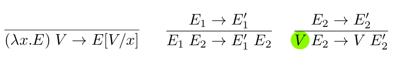
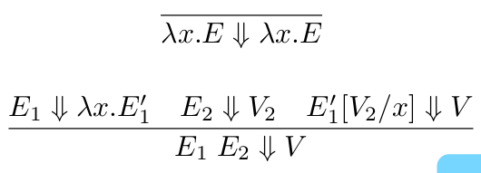
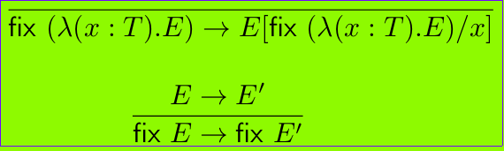

# Structured Types: Lambda Calculus

## Small Step Semantics

## Big Step Semantics

where $E[V/x]$ is the substitution of $x$ with the value $V$ inside the expression $E$.

Pure lambda calculus has no stuck closed terms. Every closed term is either an abstraction or an application. For applications, we inductively argue that the left-hand side is not stuck, hence it either has a reduction or is an abstraction. In the latter case, the application can reduce.

Not all terms reduce to a value.
$(\lambda x . x x)(\lambda x . x x)$ reduces to itself, meaning it will reduce forever!

Untyped lambda-calculus is not the best way to design a language. Recursion should be an explicitly added feature, not a feature that sneaks up. 

In simply typed lambda calculus, every well-typed term evaluates to a value. No loops, no recursion. Because all terms terminate, it cannot be Turing complete! We need to explicitly introduce recursion back into the language.

We need to implement an operator 'fix' that creates recursive behaviour.

