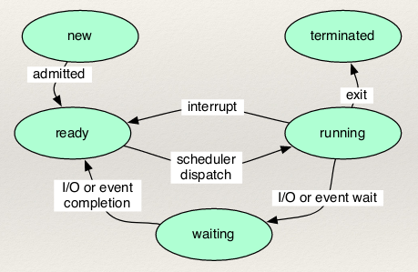

# Race Conditions

Concurrency: several computations executing simultaneously, potentiall interacting with each other

Process: OS abstraction, typically involves an address space, a number of threads (each with its own call-stack, where threads share an address space)

Operation of switching control from one thread to another is a context switch. It happens at the granularity of machine level instructions. Can happen in middle of a high-level operation (assignment of a variable).

Race conditions is where two or more threads attempt to change a variable or other piece of information at the same time, leading to non-deterministic behaviour. It is caused by two things working in conjunction with each other:

* Aliasing
  * Same location on heap accessible by multiple threads
  * No aliasing, no problem! (Rust concurrency)
* Mutability
  * Data on heap can be altered
  * No mutability, no problem! (Clojure concurrency)

## Critical Regions and Mutual Exclusio

Critical region: part of program where shared resource is accessed
Mutual exclusion: If one thread is in the critical region for a resource, no other threads allowed to enter their critical regions

Busy waiting: Blocked threads keep checking the status of lock and turn variables.
Modern compilers/hardware reorder instructions with individual threads (with (weak) memory models).

Atomic operations can be provided by the hardware through test-and-set lock instructions (TSL RX, LOCK)
Reads the value of memory location LOCK, writes the value to register RX and then stores a non-zero value at LOCK. It is guaranteed to be indivisible.

In programming languages, a similar operation is given as a language primitive
Compare-and-set