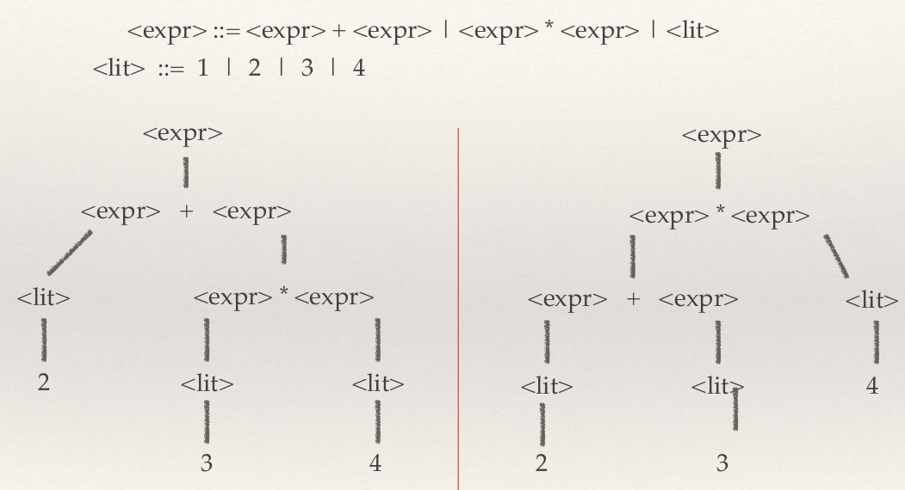
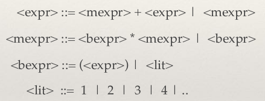
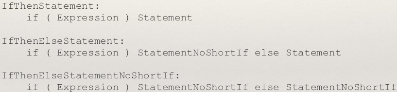

# Syntax, BNF and Parse Trees

Syntax - The rules of writing a program (not following the rules results in compile-time errors)
Semantics - The meaning of programs (what happens if we execute it). Optimisation is more of a semantic idea than a syntactic idea

## Backus-Naur Form (BNF) and Parse Trees

BNF is a convenient syntax for CFGs, which is a metalanguage. It is formed of non-terminals and terminals (also called tokens, lexemes)

An example BNF for a program:

```
<program> ::= begin <stmt_list> end
<stmt_list> ::= <stmt> | <stmt> ; <stmt_list>
<stmt> ::= skip | <assgn>
<assgn> ::= <var> = <expr>
<var> ::= X | Y | Z
<expr> ::= <var> + <var> | <var> - <var> | <var>
```

The legal sentences of a grammar are those strings for which there is a derivation in the BNF.

The derivations can be transformed into *parse trees* (like a syntax tree), which are often used by the compiler/interpreter to assign semantics to phrases.

Some sentences though can have more than one derivation, in which case we can say that a given grammar for it is ambiguous.


We can solve this with either parenthese everywhere (which is a naive solution) or by deciding upon operator precedence.

+, - and \*, / typically have the same precedence as each other. In which case we must decide how to bracket our operators. We must decide the *associativity* of the operators.



The above BNF solves the issue by changing the precedence of the operators. We evaluate brackets first, hence they are last in the tree. Then multiplication, then addition.

### ### Left-Associative Grammar for + - Expressions

1+1+1 = (1+1) + 1

```
<expr> ::= <nat> | <expr> <symbol> <nat>
<symbol> ::= + | -
<nat> ::= 0 | 1 | 2 | ... | 9
```

### Right-Associative Grammar for + - Expressions

1+1+1 = 1+(1+1)

```
<expr> ::= <nat> | <nat> <symbol> <expr>
<symbol> ::= + | -
<nat> ::= 0 | 1 | 2 | ... | 9
```

Come up with grammars for +, -, *, / where it is left-associative and follows BIDMAS.

```
<expr> ::= <m_expr> <symbol> <expr> | <m_expr>
<m_expr> ::= <m_expr> <m_symbol> <nat> | <nat>
<nat> ::= 0 | 1 | 2 | ... | 9
<symbol> ::= + | -
<m_symbol> ::= * | /
```


## if-then-else Ambiguity

```
<if_stmt> ::= if <expr> then <stmt> else <stmt>
            | if <expr> then <stmt>
```

Given the above statement, does the following statement loop or terminate?

```
if true then
	if false
		then skip
	else loop_forever();
skip;
```

We don't know! There is ambiguity in the grammar, and as a result there are two different parse trees. The parse tree it chooses will directly change the behaviour of the program.

Java solves it as follows:



## EBNF

EBNF is syntactic sugar for BNF, which does not increase the expressivity. Although there exists standards, many people use their own standards for EBNF.

## Processing Syntax

We have shown how to use grammar to go from derivations to strings. However, we should also be able to go the other way; given a string, does there exist a derivation in a grammar?

This is the core principle behind lexing and parsing. We will be using and doing:

* Program string
* Identify token
  * Lexer, using regular expressions
* Produce abstract syntax
  * Parser, producing a parse tree