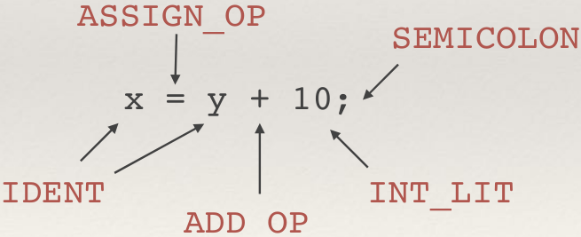
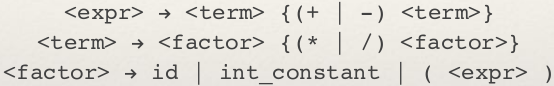

# Lexing and Parsing

Given a string, does there exist a derivation in the grammar of the language?

## Lexing

Lexing is essentially pattern matching on some text. We will be identifying the tokens in a string and then interface this with a parser.

The tokens are identified using regular expressions. A lexr constructs an automaton, which is executed as the individual characters are read into the lexer.

## Parsing

There are two main types of parsers. Top-down and bottom-up.

### Top-Down

The parse tree is built from the root down. They are recursive descent parsers, under which falls LL grammars (with leftmost derivations).

### Bottom-Up

The parse tree is built from the leaves up. They are similar to pushdown automata, under which falls LR grammars (with rightmost derivations).

### Recursive-Descent parsing

Recursive descent parsers typically have one procedure for each production rule of the grammar.
For example:

