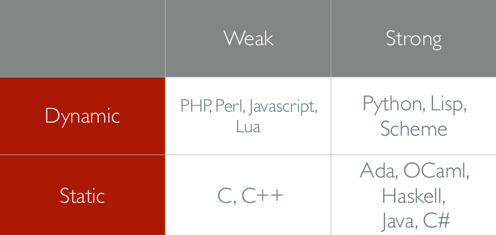

# Introduction to Type Systems

Major concern of Software Engineers should be the correctness of the software they produce. Correctness can mean many different things:

* Software testing
* Model checking
* Hoare logics

The one that can be use is type systems. We all use these already! They are a lightweighth formal method.

A tractable syntatic method for proving the absence of certain program behaviours by classifying phrases according to the kinds of values they compute.

They are the particular classifications of program behaviours that one makes. For example, in simple type systems for C functions we classify programs according to the number of and primitive type of the arguments along with the type of the result of the function.

Types are:

* Abstract descriptions of programs
  * Can study correctness properties of interest by abstracting away all low-level details
* Precise descriptions of program behaviours
  * Can use maths tools to formalise and check these properties

## What Types Do

Types are concerned with correctness, we use type systems to gaurantee absence of particular behaviours:

* application of expression to wrong kind of data
* existence of method/field when invoked on particular object
* array lookup of correct dimension

Can be used to enforce high-level modularity:

* maintain integrity of data abstractions
* check for violation of information hiding

They enforce disciplined programming:

* type systems form backbone of module-based languages for large-scale composition
* types are interfaces between modules
* encourages abstract design
* form of documentation

## How to Use Types

Different approaches to using types:

* Strongly Typed
  * Prevent programs from accessing private data, corrupting memory, crashing machine, etc
* Weakly Typed
  * Do not always pevent errors, use types for other compilation purposes (memory layout)
* Static Typing
  * Refers to when type checking occurs - compile time
* Dynamic Typing
  * Refers to type checking delayed until runtime

### Strong vs. Weak

Strong types means that included types must be declared or inferred with functions/methods. Can make language verbose.

Weak typing means that data of the wrong type may be passed to a function and a function is free to choose how to behave.

### Static vs. Dynamic

Static type necessarily use an approximation of runtime types of values:

* Statically determining control flow is undecidable
* Compile time checking can avoid costly runtime errors
* Types are used for memory layout, static typing appropriate

Dynamically typed languages check types at runtime:

* Exact types can be used
* Allow variables to change type of data they store, or objects to dynamically grow
* Very common in scripting languages and web
* Not to be used for critical systems as errors detected too late

