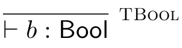

# Typing Rules

Compiler needs to check that, at any point in a program's execution, the program doesn't attempt to consume data of wrong type.
Amounts to checks on abstract syntax trees according to the types of data being used.

Every program fragment $E$ needs to be given a type $T$ in order to build a picture of whether the AST is well-typed.
We define 'typing relation' written $\vdash E : T$, read $E \text{ has type } T$.
We need to define this for every possible program $E$.

Do local checking on syntax trees:

* Type of program $op(E_1, E_2, ..., E_n)$ depend only on types of $E_1, E_2, ..., E_n$
* Only certain operators generate actual checks for correct usage of types
* May need to approximate type where we can't determine it statically

## Type Derivation Rules

General form of type derivation rule is:

Reads as 'if the relation holds for the things above the line, the relation holds for things below the line.'

In order to show that $\vdash E : T$ holds, the rules must be formed in such a tree that the leaf nodes of the tree have no premises.

Let's define type derivation rules for Toy:

We can define the rules for values:
 

We can define a conditional expression:

We need to have assumptions about the types of free variables in $E$. We call these assumptions typing environments, and use greek letter $\Gamma$ to represent them.
A type environment $\Gamma$ is a mapping from variable names to Types. Written as comma-separated bindings.

Only three more rules:

We can add two more rules for lambda calculus to our language:
$$
\lambda (x:T)\text{ }E \text{ and } E E
$$
The type rules are as follows:

