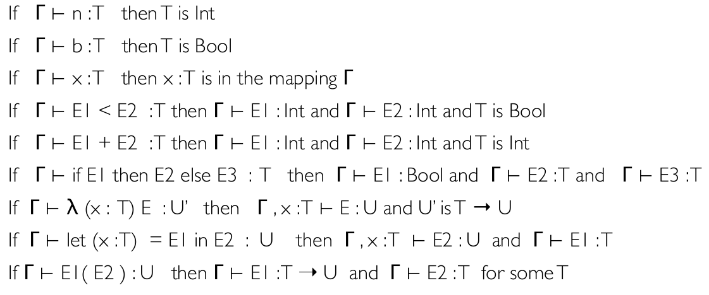
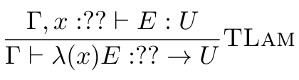

# Type Checking and Inference

Using the inversion lemma, we can infer the types of subprograms from the type of the whole program. By reading the type rules from bottom to top.

Here is the inversion lemma for Toy:

It is very straightforward to turn this into Haskell code.
In a dynamically typed language, you would need to infer the types of these entities  from their usage in the code.
e.g., let x = 20 in y + x would reasonably allow the type checker to understand that both x and y would by type int.

Lets look at the Lambda rule in Toy.
Suppose we don't know T and U as part of the syntactic defintion.

The approach often taken to solve this is to introduce type variables. Symbolic values that represent an unknown/unconstrained type. Certain constraints on these type variables will arise. e.g., iff an argument to a function of unknown type is used as a guard of an if statement, it is a boolean.

To obtain an actual type for the program, we need to solve the constraints. Find substitution of type variables such that all constraints hold; this is called unification.

Lets use the following:
let foo = \\(x) if (x < 3) then 0 else (x + 1) in let cast = \\(y) if (y) then 1 else 0 in cast (foo (42)))

1. Unfold the let
2. Unfold the \\x expression
   * Constraint a = c -> d
3. x <3 : Bool, 0 : Int, (x+1) : Int, requires x : d to have type Int so constraint c = Int is generated. d = Int as well
4. Unfold second let statement
   * cast : e. \\\(y) if (y) then 1 else 0 : e, cast(foo(42)) : f. b = f
5. Unfold \\y expression
   * Constraint e = g -> h generated
6. Unfold the if. y: Bool, so g = Bool. h = Int
7. Unfold applications.
   * cast(foo(42)) : f, with constraint f = h, further by unwinding foo(42) we get c = Int
   * Can also infer g = d because d is the return type of foo

