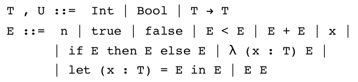
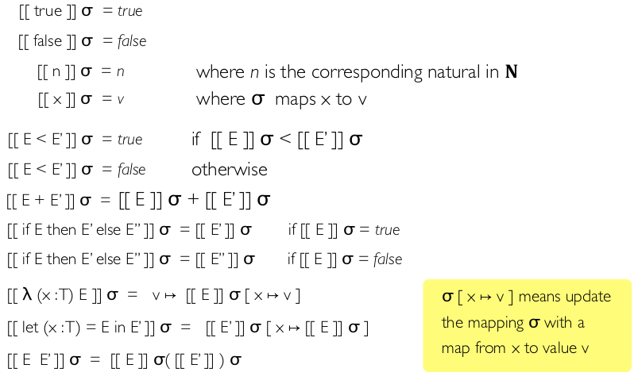
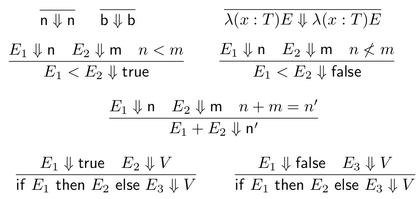
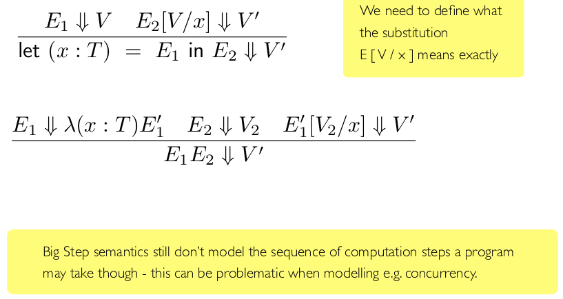
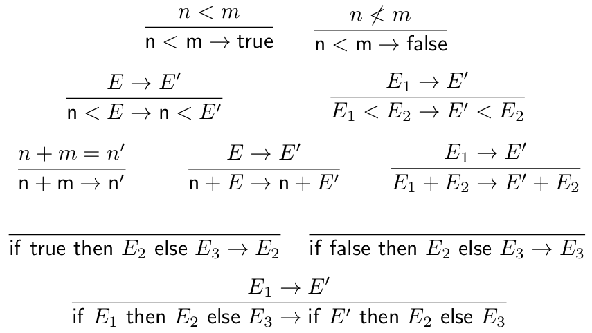
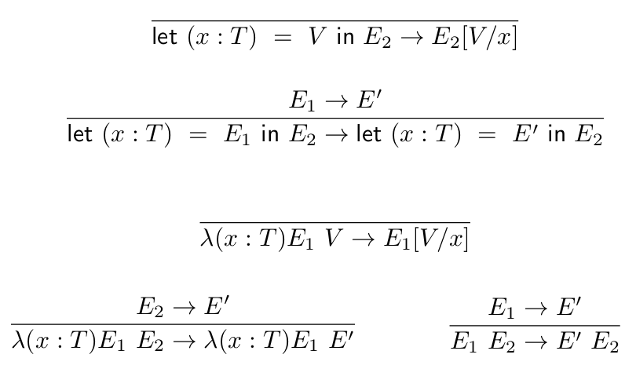

# Intro to Semantics

Semantics are the meaning of programs:

* Specification of a program's runtime behaviour
  * What value it computes, side-effects, etc
* Semantics of programming language is specification of how language construct affects behaviour of programs written in language

## Why We Need Formal Semantics

Not all compilers agree with each other! They are large programs, possible they contain bugs themselves. So meaning of programs is susceptible to compiler writer error.

Produced low-level code is often inscrutable. Hard to use compiler source code to trace source for subtle bugs in code due to strange interpretations of language operators.

Compilers optimise programs for maximum efficiency. Can disturb structure of code, make reasoning about it harder.

## Advantages

Formal semantics should be precise, written in formalism more amenable to analysis.

* Some form of logic or other mathematical language
* No worry about efficiency
* Focus on unambigiuous specification of meaning of language constructs
* Reference 'implementation' of a language
* Can be built in compositional ways that reflect high-level program structure

## Approaches

### Denotational

Mapping every program to some point in a math structure that represents the values that the program calculates

```
[[ if (0<1) then 0 else 1 ]] = 0
```

### Operational

Use relational approach. Inductively defined relations between programs and values produced.

```
if (0<1) then 0 else 1 -> if (true) then 0 else 1 -> 0
```

### Axiomatic

Meaning of a program is what properties you can prove of it using a formal logic (e.g. Hoare logic)

## Denotational Semantics

Must first identify *semantic domain* in which we will map programs.

Elements in semantic domain represent meanings of programs. Built by following structure of the types of languages. Structures of types would make for well-known, simple mathematical structures in semantic domains.

### Toy Language



We choose a semantic domains. Will either be $\mathbb{N}$ and a different two element set $\mathbb{B}=\{\text{True},\text{False}\}$. Also make use of function spaces between sets.

Define $[[T]]$ to be $\mathbb{N}$ when $T$ is an Int, and $B$ when $T$ is a Boolean, define:
$[[T \rightarrow U]]=[[T]] \rightarrow [[U]]$

We need to produce a function $[[-]]$ from well-typed programs $E$ of type $T$ to semantic domain $[[T]]$:
Given $\vdash E : T$, then $[[E]]$ of value $[[T]]$.

We need to have an environment to provide values for the variables.
Given term $\Gamma \vdash E : T$ then need an interpretation $[[E]]$ that makes use of environment $\sigma$ that maps each free variable in $\Gamma$ to a value in semantic domain.
We write $[[E]]_\sigma$ to denote this.

$\sigma$ satisfies $\Gamma$, written as $\sigma \models \Gamma$, whenever $\Gamma (x) = T$ then $\sigma(x)$ is a value in $[[T]]$.
We require that, for $\Gamma \vdash E : T$ and for all $\sigma$ such that $\sigma \models \Gamma$, then $[[E]]_\sigma : [[T]]$



Don't give a very clear account of how the program is actually supposed to execute.
Give very precise and nicely compositional account of what values the program is supposed to calculate.
Can be useful for modelling pure functional languages, can be trickier for modelling languages with mutable states or concurrency for example.
What value does a non-terminating recursive loop maps to?

There is a lot of 'junk' in the model. The semantic domain $[[\text{Int} \rightarrow \text{Int}]]$ is all functions from $\mathbb{N}$ to $\mathbb{N}$ - includes uncomputable functions. Model is 'too big' in a sense.

## Operational Semantics

Two flavours: big step and small step.
We write $E \Downarrow V$ to mean program $E$ goes to value $V$.





We write $E \rightarrow E'$ to represent small step semantics, E evaluates in one step to program state E'.





