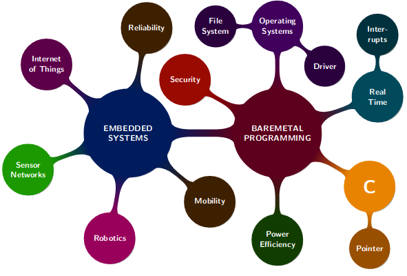

# Introduction

Should be called "Bare-metal programming" according to Klaus
Involves baremetal programming (C) and embedded systems.

Build an OS in the module.

## Requirements

Need own computer and install stuff required on it.
Learn programming language on the side.
Take initiative.
Search thru vast amounts of tech docs.

## Marks Breakdown

20 marks - Fun exercises
One a week
Make sure to actually try these
Spend approx. 2-3 hrs on these each
Full marks for any answer. Not an excuse not to do the exercises, as "you'll die in the exam" according to Klaus.

75 marks - A **tough** exam
Model answers for previous exams are already available on the wiki. Commented on by Klaus.
To  do well, try to solve all exercise tasks. Know, understand and be able to apply material covered in lectures.

5 marks - Exceptional contributions (e.g. submit to the student wiki, submit to a competition)