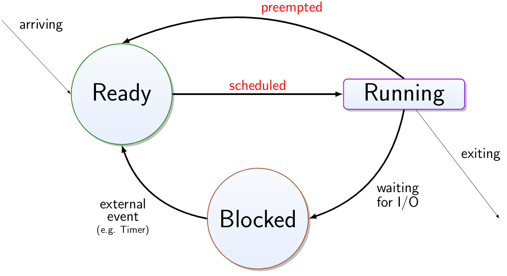

# Multitasking and RIOS

We use an operating system for:

* A uniform interface
  * For users
  * For programs
* Management of resources
  * CPU time
  * Memory
  * Access of devices
* Management of interactions
  * Desired interactions, e.g. networking, comms.
  * Undesired interactions, e.g. protection, security

With an OS, multiprogramming is available. Multiple programs can be executed on CPU. If one process needs to wait for I/O, the CPU can work on another process. This allows for increased throughput and CPU utilisation.
This allows for pseudo-parallelism.

## Processes 

A process has an entry in the process table that typically contains:

* Instruction counter
* Stack pointer
* Assigned address space
* Associated resources
* State

One can also talk about tasks/threads.

## Process States

## Scheduling

A scheduler decides which process from the set of ready processes will get the CPU next.
Requirements for a scheduler differ according to the nature of the processes and the computer system.

Different criteria that the scheduler can select:

* First-come first-serve
* Shortest job first
* Round robin
* Shortest time left
* Priority scheduling
* Lottery scheduling

## Context Switching

Context switching has an overhead. Switching from user processes to a kernel process or vice versa.
Context switching overhead can be caused by:

* Saving/restoring
  * Program counter
  * Stack register
  * Status register
  * GP registers
  * Memory map
  * I/O status
* Memory cache is invalidated
* Working set of pages is invalidated

### Round Robin

Every process gets a time slice and is served it in a fixed order. A short quantum can lead to a high overhead for context switching. A long quantum allows for a long response time, with good efficiency. Processes block for I/O before the quantum expires.

### Lottery Scheduling

Processes receive lottery tickets according to the share of CPU time they should receive.
A ticket is chosen at random and the CPU is allocated to the process that holds the ticket.
Processes can share tickets.

It is easy to share the CPU, but not guaranteed.

## RIOS

A minimalist but practical scheduler, with fixed priorities, preemptive multitasking and bounded stack usage all in roughly twenty lines of C.

Tasks execute within an ISR. The preemption means it is reentrant, with nested interrupt which maintains its own stack of running tasks. Although, one should be careful with printf. However, there is no self-preemption. The stack depth is bounded by the total number of tasks, with the highest priority task in the stack always on top.