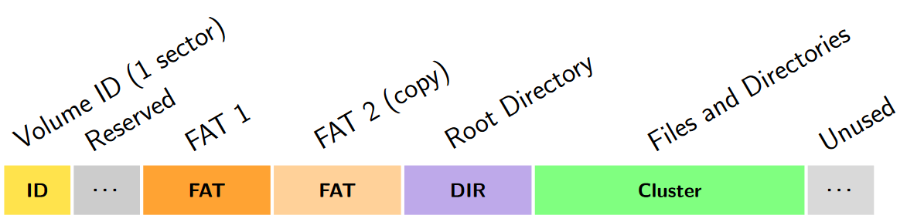
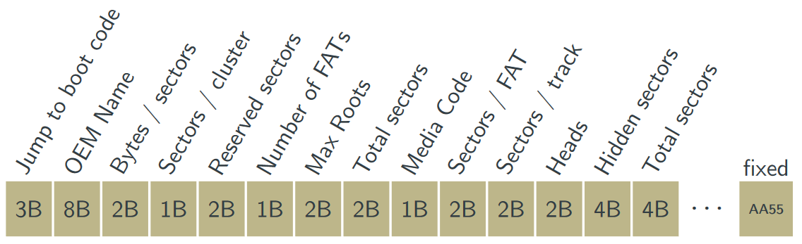
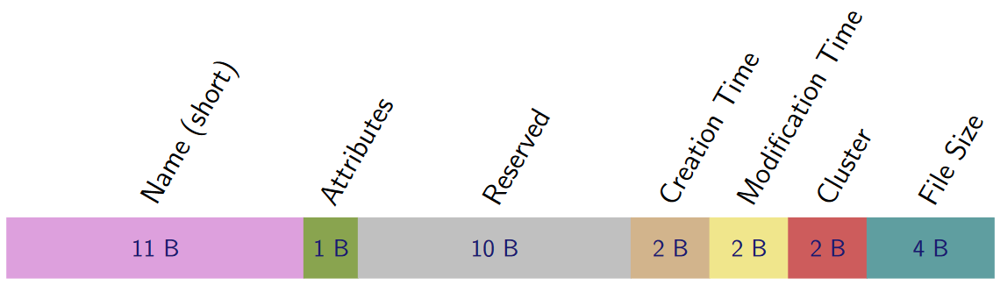
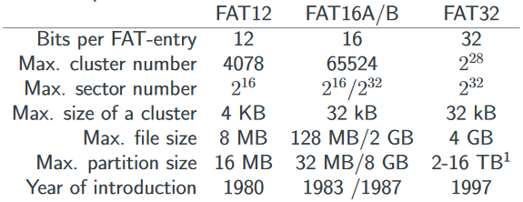
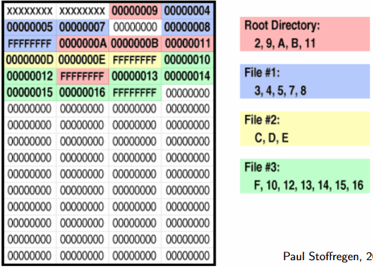

# FAT File System

Between the device driver and applications sits the file system, the file abstraction to make handling files easier for applications.

It is an important component of the operating system.
It contains non-volatile storage of large amounts of information, a file structure, naming, access and file operations.

A file system uses a low level format on the physical layer, with a low level protocol at the firmware level. The metadata needed for it is the master boot record, with partitioning achieved with this. The file systems are in the partitions.

FAT is relatively easy to understand and does not require many resources.
FAT FS metadata contains the File Allocation Table and the directory entries (such as start, size, name, etc)

FAT FS developed from CP/M disk format.
CP/M -> QDOS -> MS DOS
Drive separated from path by colon, still is

## Layout

Master boot record.
Partition table:

* Bootable?
* First block
* Type
* Size

Partitions

Partition:

* Volume Boot Record
  * Name
  * Size of sectors and clusters
  * Sectors per file allocation table
  * Hidden sectors

General disk layout contains the master boot record in the first sector, then partitions afterwards in many sectors.

## FAT FS Partition

First sector of a FAT partition contains volume ID (aka volume boot record, partition boot record).

Volume ID contains the following:

Root directory contains the following:

Attributes byte contains:

* Modified bit
* Subdirectory bit
* Volume label bit
* System file bit
* Hidden bit
* Read only bit

Other two bits left are reserved

To read a file, we need the disk layout and the FAT partition layout.
The partition table in the MBR:

* Keeps the first partition in the table as `0x1BE`
* Makes each entry 16 bytes long
* Has a maximum of four partitions
* Uses byte 4 to indicate partition type
* Uses the last 8 bytes to indicate:
  * `LBA begin` in four bytes
  * The length of sectors in four bytes

`FAT start` is the `LBA begin` + (`Reserved Sectors` x `Bytes / sector`)

`Root start` is the `FAT start` + (`No. of FATs` x `Sectors / FAT` x `Bytes / sector`)

`Data start` is the `Root start ` + (`Max roots` x 32)

## SD Card

Simplest way of reading from SD card is to format the SD card with a single FAT 16 or FAT 32 partition. Write a single file to it.

The Volume ID of the partition will be on the second sector. Calculate from the Volume ID the start of the file. If the end of the file can be recognised, read it. Else, calculate the start of the root directory. Read the last four bytes of the first entry (the file length). Then read that many bytes.

## Limitations

FAT was originally developed in the late 70s for floppy disks.

FAT32 also indicates access time as well as creation time. It separates cluster in to H bits and L bits.

The file format can be distinguished by the driver software based on the number of clusters.

If `c < 4085`, FAT12. `c < 65525`, FAT16. Else FAT32.

## Extensions

* VFAT
  * Long file names
  * Hides longer names in directory entries with an unused property flag
* TFAT
  * Transactional FAT
  * FAT1 updates -> transaction -> FAT0 updates
* exFAT
  * Extended FAT
  * UNIX-like linked list instead of a FAT

## File Allocation Table

| FAT Entry     | Interpretation             |
| ------------- | -------------------------- |
| 0x000         | Unused                     |
| 0xFF0 - 0xFF6 | Reserved                   |
| 0xFF7         | Bad (do not use)           |
| 0xFF8 - 0xFFF | End of Cluster Chain (EOF) |
| Anything else | Index to next cluster      |

First entry is the media type. Matches that of the boot record entry.
Second entry is the partition state. FFFF for clean, FFF8 for dirty. Dirty at start means it could be corrupted.

Not all bits of cluster entry may be used.
FAT is stored by least significant bit first (little-endian)