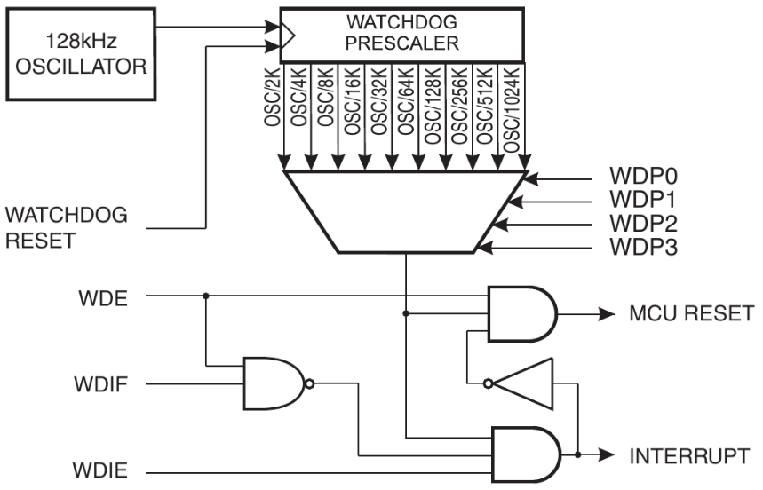
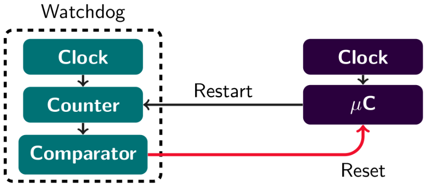

# Watchdog Timers

Typically, embedded systems need to operate continuously. They cannot rely on human supervision:

* The system may not be easily accessible
  * Implanted device
  * Space probe
  * Radioactive zone
* Human supervision is too costly
* Human supervision is too slow

Therefore, we use a watchdog to supervise the system instead of a human.

## Watchdog

A watchdog is a hardware counter with its own clock, and therefore timer.

When the timer runs out, the system receives a hardware reset.
Software in normal operation will restart the timer before it runs out.

An example of a software fault is an endless loop, an interrupt flood or deadlocks from multitasking with more than one thread.

## Watchdog in the AT90USB1286

Has a programmable watchdog timer with a separate on-chip oscillator.

The time-out of the watchdog can cause a reset of the system, an interrupt, or an interrupt and then switch to reset mode.

You can vary the time range from sixteen milliseconds all the way to eight seconds.

If you use interrupt, the ISR on the watchdog timer will take the action given to it. If you reset, check the watchdog reset flag (WDRF) in the MCU status register to recognise if the system was reset due to a time-out. Be sure to reset the peripheral hardware too!

## Usage Scenarios

* Wake up from sleep
  * Use an interrupt
  * Other oscillators can be powered down
* Time-out on operations
  * Use an interrupt
* Exit system hangup
  * Use a reset
* Recover from an assertion fault
  * Use a reset
  * Log the fault
  * Enter an endless loop
    * Be sure to watch out for real-time requirements!
* Recover from a task death
  * Use an interrupt and reset!
  * Verified task execution as a condition for feeding the watchdog

## Power Consumption

Watchdog's oscillator is much slow that typical main clock, requires less power. Can be used to wake from sleep instead of timer running off main clock.

Watchdog runs in all sleep modes, therefore always consumes power. May be dominant power consumption in deep sleep.

## Protection

It is important that a run-away program does not accidentally disable the watchdog timer before it times out.

You can set the watchdog by fuse programming to be always on, and therefore fixed into reset mode.

The configuration bits for the reset mode and time-out are protected by a specific write sequence to avoid a situation as mentioned above:

* In one operation, write a 1 to:
  * the watchdog change enable bit (WDCE)
  * the system reset mode bit (WDE)
* Within four clock cycles:
  * write the desired value to WDE
  * write prescaler bits (WDP0 - WDP3)
  * write 0 to WDCE

It is important that a watchdog timer does not accidentally disable a system. If it is not always used, clear its enabling bits at the start of program initialisation.

## avr-libc support

`#include <avr/wdt.h>`

Enable the watchdog with a given timeout period: `wdt_enable(WDT0_1S);`
Reset the timer: `wdt_reset();`
Disable the watchdog: `MCUSR = 0; wdt_disable();`

After the watchdog has been triggered, it will start enabled with the fastest prescale value. If program initialisation takes longer than the time-out period, the device locks up in endless reset cycle.

In general, count number of watchdog induced resets. If this seems excessive, disable watchdog.

## In Practice

Applications for the timer:

* Fault recovery
* Low power oscillator
  * Wake from sleep
  * Timing is not precise!
* Clean software reset
  * Firmware update
    * Bootloader
  * Enable watchdog
  * Enter endless loop

Watchdogs differ from device to device. Some watchdogs can only be enabled, not disabled. Some allow extra delay during first time-out period, to account for initialisation. Some are disabled after a time-out and need to be enabled during initialisation.

### Stuck Tasks

Time-outs should protect any task that waits for external events from locking up. They can be the last defence or part of the time-out design.

### Multi-tasking

Monitor tasks can watch over other tasks. All tasks report their operation by acting on global set of flags. Monitors task only restart the watchdog if all tasks reported success.

Often, tasks run at different time scales. Frequent high-priority tasks may be critical. Less frequent task report at much lower frequency.