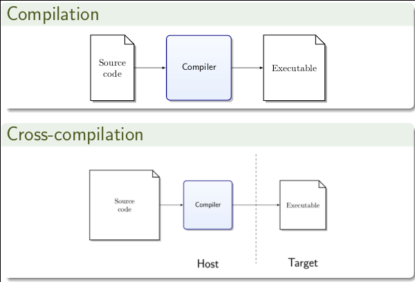
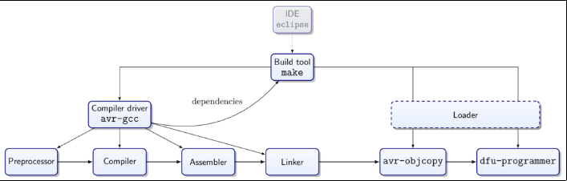
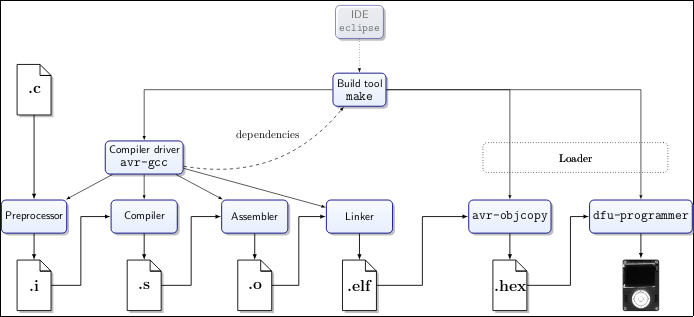
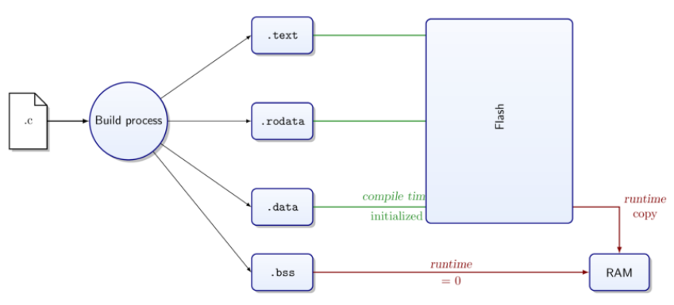

# Cross-compilation

Focusing this week on 'from source code to memory'. It is important for understanding C.
Compiler spews all problems with your code at once when it reaches something it doesn't understand.

A compiler has a front-end and back-end. Cross-compilation swaps out the back-end to target a particular architecture of CPU different than that of the host. You compile for the target, not for the host.

Cross-compilation is used when compilation to target impossible/impractical. Used on first compiler on new hardware/OS, or low capability targets (embedded systems).

Architectures of host/target can be very different

* Memory architecture
* Word size
* Endianness
* etc...

The basic slide shown is fine for interpreting error messages and considering configuration options. We care about:

* Compiler optimisation
* Compiler warnings
* Libraries

A change to the compiler optimisation can make a drastic change to the speed of your program. This matters with embedded systems, where memory and CPU usage conservation matters.

The build process will make intermediate files, as shown below. The loader will load the given code onto 

## Linker Output: .elf

ELF stands for Executable and Linkable Format. It is a platform independent binary interface for object files. It contains layout info and sections.

Can be:

* A relocatable (.o)
* An executable (a.out/.exe)
* A shared file (.so/dll)

### Sections

There are twenty-four different types in ELF, but the four below are sufficient.

* .text -> Instructions (located in flash)
* .rodata -> Read-only data (located in flash)
* .data -> Initialised global variables (located in flash, which is copied to RAM)
* .bss -> Unitialised global variables (located in RAM and zeroed out)

The compiler will assign the program and its data into sections, which takes into account the scope and the qualifiiers such as const.
The linker places the sections into virtual memory.
The loader places the sections into physical memory.

C source code has three scopes:

1. Program wide scope
2. File scope
3. Block scope (in parentheses { } )