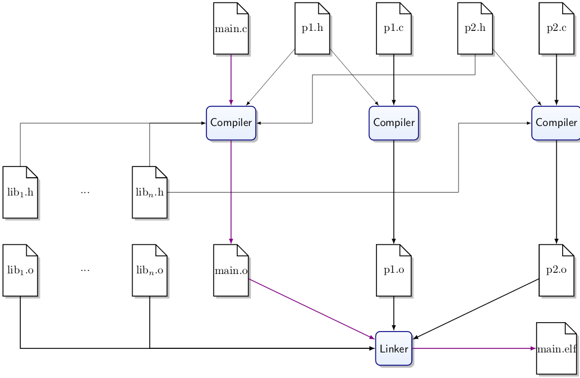

# Programming in C

C is easy to learn and implement. It is pragmatic, which trumps aesthetics. It is portable and close to the hardware. The core language has no I/O and no dynamic memory management.

C puts you in full control and doesn't get in your way, regardless of how big of a mistake you may make.
There are *no safety nets* at runtime for efficiency reasons.

## When to Use C?

Where C is used, there is typically no alternative language available.
It is typically used:

* If low-level hardware access is required
  * Drivers, privileged CPU mode, configuration of hardware
* When runtime resources are critical
* When realtime behaviour is critical
  * You have complete control
  * No screw-ups in predictability
* For very low capability systems
  * C can run on systems without RAM
* For software for new hardware
  * C is often the first language available
* For highly portable programs

C is also great for use in small pieces of code. For example, you can code your program in Python, identify the hotspots where the program is computationally intensive and then replace this code with C code.

## C in Embedded Systems

Typicallly has a small amount of code, but there is a large number of deployments (mass produced systems). You can use a cheaper processor/smaller battery and use C instead of a language with a higher overhead (Python). It's a worthwhile trade-off!

## Which C?

The most widely supported version of C is C89. A subset of C99 is in common use at present.
One can also consider the portability of C from one processor type to another, from board to board or from compiler to compiler.

## Translation Units

### Header Files (*.h)

Header files contain declarations for exposed functions and variables. They are included with preprocessor commands in source files that hold corresponding definitions and in source files that make use of the declared functions.
They also act as a form of documentation.

### Things to Be Aware of from the Start

When coding in C, keep in mind unspecified behaviours, undefined behaviours and unexpected behaviours.

For example, values or behaviours are undefined. The failure to adapt to the hardware that is being used, or the size of int being undefined.
Behaviours defined can cause an error for which the standard does not prescribe any action, meaning it is not clear what will happen and can cause arbitrary behaviour at arbitrary time.

In some contexts, zero is special. Any value that isn't zero is considered 'True', a zero byte marks the end of a string and a pointer to the address zero is invalid.

You also need to consider the precedence of operators.